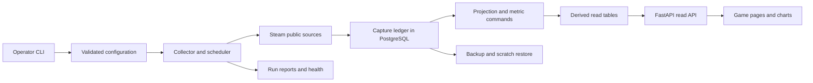

# Game Census — Product Requirements Specification

> Status: DRAFT / LIVING DOCUMENT — the P0–P1 local slice is implemented and locally verified. The checklist and walkthrough own completion evidence; the broader specification remains proposed.
> Created: 2026-09-04. Section 1.5 identifies the as-built subset; the remaining full-product targets retain their proposed status.
> No section has owner ratification. No governing ADR exists in this planning repository.

## 1. Introduction & scope

### 1.1 What this document is

This is the canonical technical specification for Game Census, a new self-hostable open source Steam statistics product. It implements the capability IDs in the [Product Requirements Document](PRD-game-census.md). It owns proposed architecture, source classifications, data contracts, calculations, configuration policy, and operational behavior. The [implementation plan](build-tasks/initial-release/implementation_plan.md) owns file changes, command inventory, work sequence, and detailed verification execution. The [backlog](BACKLOG.md) owns unresolved decisions. [FR-01–FR-10, NFR-01–NFR-04]

The first usable build adds a Python package, PostgreSQL schema, locked dependencies and a local Docker setup. The [implementation plan](build-tasks/initial-release/implementation_plan.md#first-usable-build-contract) distinguishes actual first-slice contracts from the future inventory. The existing bounded planning probe remains separate evidence: its [unedited source capture](build-tasks/initial-release/evidence/source-probes.json) records HTTP 200 responses for current players, basic Store metadata, and review summary. It does not establish all-app coverage, authenticated access, or production capacity. [FR-02, FR-07, FR-08, NFR-04]

### 1.2 Governing decisions

There are no governing ADRs. The first local implementation follows the Python/PostgreSQL architecture and Apache-2.0 code default proposed in the development plan. This is an implementation choice within the authorized first usable build, not owner ratification of the complete PRD or approval of public branding/data redistribution. [NFR-02, NFR-04]

Owner decisions are deferred to [BACKLOG.md](BACKLOG.md): GC-B01 covers code license and name, GC-B02 covers hosted distribution, hosting, and privacy, GC-B03 covers exact toolchain selection, GC-B04 covers authenticated and broader source validation, and GC-B05 covers optional extensions and adoption baselines. No contact with Valve or another party is authorized by this drafting task. [FR-05, FR-07–FR-09, NFR-01, NFR-04]

### 1.3 Out of scope for this PRS

P0–P5 exclude SteamDB scraping or historical backfill, universal high-frequency tracking, personal Steam accounts, player profiles, and library crawling. They exclude exact sales, ownership, revenue, unique active users, demographics, and bot classification. They also exclude private branches, depot contents, manifests, keys, player login, messaging alerts, monetization, and a mobile application. P6 candidates require source evidence and a separate extension plan. [FR-02–FR-09, NFR-01]

This document does not supply implementation phase tasks, fabricated test output, an approved deployment, or an invented ADR. Detailed execution remains in the implementation plan. [NFR-04]

### 1.4 Document conventions

Capability references use the PRD IDs `FR-01` through `FR-10` and `NFR-01` through `NFR-04`. A cited range includes every ID in that range. A section's references apply to its rules and tables unless a narrower reference appears. Every requirement below describes intended behavior until code and command evidence replace that status. [NFR-04]

| Term | Meaning |
|---|---|
| Game Census | The single product name, pending GC-B01 clearance |
| Visitor | An anonymous person viewing stored statistics through the browser or read API |
| Operator | A person with command-line access to configure and operate one Game Census instance |
| Instance | One deployment with one shared capture ledger, cohort policy, and quota ledger |
| App | A Steam application identity, represented by `app_id` |
| Tracked cohort | Apps enrolled for collection during explicit tracking intervals |
| Capture | The canonical retained source response or identified aggregate-only projection |
| Observation | A validated source value derived from a capture |
| Source policy | Versioned enabled state, parameters, and adapter policy |
| Proposed default | A design input that becomes a code-owned schema default when implemented |
| Code-owned bound | A validity constraint the program enforces against untrusted configuration |

Source facts have one canonical owner. Projections and exports must be rebuildable from that owner. Every displayed statistic carries source, time, scope, availability, and applicable coverage. Unknown, unsupported, failed, and successful zero remain distinct. No component uses a model as its connection to another component. [FR-02, FR-03, FR-06, NFR-02]

**Boundary:** A requirement, completion claim, or source observation must not masquerade as stronger evidence. **Observable:** inspect its status, capability reference, source capture, and command output. **Envelope:** none. [NFR-04]

### 1.5 As-built first usable contract

This subsection records the first-usable baseline. The P2 additions are specified in section 10.1 and its linked increment packets; statements below describe the original P0–P1 boundary. The remaining sections retain the full-product design targets where they exceed those implemented slices. Initial completion evidence belongs to the [walkthrough](build-tasks/initial-release/walkthrough.md). [FR-01–FR-10, NFR-01–NFR-04]

The CLI initializes an empty PostgreSQL database, enrolls configured app IDs and collects one manual run. Two additive migrations install capture/projection/attempt/run/tracking tables and durable source cooldowns. The collector reserves attempts before dispatch, serializes manual collectors, charges retries and uncertain attempts, honors admitted host spacing and Retry-After, and records explicit succeeded/partial/failed outcomes. Scheduling, leases for scheduled jobs, partitioning and rollups are not implemented. [FR-01, FR-02, FR-04, FR-10, NFR-01, NFR-02]

Current-player captures retain the acquired payload and checksum. The optional Store adapter retains an identified name-only allowlisted capture; it does not retain the full Store response or supply prices. Both adapters use fixed public HTTPS hosts. Pages never request Steam data. App enrollment is retained independently from the current collection configuration: removed collection targets keep their visible observations. Catalog discovery, full-catalog search and comparisons are unavailable. [FR-02, FR-05–FR-09, NFR-01, NFR-02]

History queries use half-open UTC windows and reject too many points. Counts and observed peaks use samples within the window. A pre-window sample may contribute covered-time integration only until its cadence-specific cap. Coverage divides covered seconds by the full requested window, including time before enrollment. No observations is null; successful zero is zero. The website draws only sample-to-sample segments that do not cross recorded gaps and supplies the complete returned data table. Freshness badges refer explicitly to page-read time; the local API poll announces changes for manual refresh. [FR-02, FR-03, FR-06]

`config.py` owns the current settings schema; `config describe --schema` generates it and `config describe` shows redacted effective values. Section 8's larger setting inventory remains a future schema proposal. The actual read interface is generated at `/openapi.json`; the available route inventory is in the README and implementation plan. Missing apps are 404, invalid query bounds are 422, and read-storage/contract failures are safe 503 responses. HTTP readiness checks an actual local server response. [FR-01, FR-06, FR-10, NFR-01, NFR-02]

The local Docker application uses one database role, retains canonical data and includes its test toolchain. Replay validates and fills missing projections; it stops on conflicts and does not provide a full backup restore. Public hardening, full-size recovery, measured capacity and hosted distribution remain unimplemented gates. The repeatable build target is the Python wheel; image provenance metadata is outside that byte comparison. [FR-10, NFR-01–NFR-04]

## 2. System architecture overview

### 2.1 Proposed components and interfaces

Use a modular Python application with one package and PostgreSQL schema. The CLI, source adapters, scheduler, projection services, and FastAPI processes share typed contracts. Begin with one collector. Additional collectors require the same database-backed lease and quota enforcement. PostgreSQL remains the datastore until measured evidence justifies another one. [FR-01–FR-06, FR-10, NFR-02–NFR-04]

The implemented stack is FastAPI/Uvicorn, Pydantic, HTTPX, Psycopg, Jinja2 and standard-library argparse, tested with pytest and Playwright. The bounded chart uses local native SVG/JavaScript and an HTML table; ECharts is not installed. P2 storage uses PostgreSQL monthly partitions and includes backup/restore clients from the same pinned PostgreSQL image. Exact tested versions belong to `uv.lock` and `build/toolchain.lock.json`; first-build evidence addresses GC-B03's runtime portion. The implementation follows the [FastAPI template interface](https://fastapi.tiangolo.com/advanced/templates/), [PostgreSQL partitioning guidance](https://www.postgresql.org/docs/18/ddl-partitioning.html), and [native backup contract](https://www.postgresql.org/docs/18/app-pgdump.html). [FR-06, NFR-02, NFR-04]



Every connection uses CLI, SQL, HTTP, or a typed in-process call. Source adapters return inspectable typed results. Browsers read stored data. A page request must not trigger an upstream Steam request. No LLM, separate frontend service, Redis, Kafka, Celery, Elasticsearch, Kubernetes, or time-series extension is required for P0–P5. [FR-01, FR-02, FR-04, FR-06, NFR-03, NFR-04]

### 2.2 Component-to-release map

| Phase | Technical extent | Capability coverage |
|---|---|---|
| P0: feasibility | Configuration, pinned runtime, source registry, one-app real CLI | FR-01, FR-02, NFR-01, NFR-04 |
| P1: vertical slice | Bootstrap, captures, projections, basic API and game page | FR-01, FR-02, FR-06, NFR-02 |
| P2: history and scheduling | Metrics, jobs, leases, durable budgets, watched enablement, run reports | FR-03, FR-04, FR-10, NFR-02 |
| P3: public alpha | Catalog, explicit cohort, search, rankings, comparison, full core read surfaces | FR-05, FR-06, NFR-01, NFR-03 |
| P4: enriched beta | Independently enabled metadata, prices, reviews, achievements, and news | FR-07, FR-08, FR-09 |
| P5: operational release | Restore/replay, capacity evidence, release locks, security and accessibility checks | FR-10, NFR-01, NFR-02, NFR-03, NFR-04 |
| P6: optional research | Only a separately evidenced and authorized extension | GC-B05, no added P0–P5 obligation |

Phase names identify implementation maturity. They do not authorize hosting, publication, or unattended operation. [FR-04, NFR-04]

### 2.3 Proposed authority locations

Application contracts will live under `src/game_census/`. The configuration schema will own setting names, defaults, and bounds. Migrations will own schema structure. Source adapters will own external field mappings. Metric services will own calculation implementations and version identities. Routes and typed contracts will generate OpenAPI. These are planned ownership boundaries, not existing files. The file inventory and regression-test assignments remain in the implementation plan. [FR-01–FR-10, NFR-01–NFR-04]

**Boundary:** A second service, copied configuration definition, or browser fetch must not become an untracked source of truth. **Observable:** inspect component interfaces, generated contracts, and capture-to-projection replay. **Envelope:** rebuildable caches and exports. [FR-06, NFR-02, NFR-04]

## 3. Data model

### 3.1 Canonical entities

Use `capture` as the canonical observation ledger. Keep identity enrollment and operational events in their own canonical entities. Source-derived names and values belong in rebuildable projections. All timestamps use UTC. [FR-02, FR-03, FR-04, FR-05, FR-10, NFR-02]

| Entity | Canonical fields and constraints | Consumers |
|---|---|---|
| `app` | Positive uint32 `app_id` stored as PostgreSQL bigint, creation and enrollment audit reference | Catalog projection, tracking, search |
| `capture` | Capture ID, source ID/version, app ID, request start/receipt UTC, secret-free parameter identity, optional source timestamp, HTTP/provider result, adapter version, payload/checksum, run/job/attempt IDs | Normalized source values and charts |
| `job` / `request_attempt` | Immutable scheduled occurrence, deadline, lease owner/version, attempt dispatch state, quota reservation, outcome | Scheduling, coverage, global accounting |
| `tracking_interval` | App, start/end UTC, cadence, source, plan version, non-overlapping validity | Expected observations, cohort history, freshness and ranking scope |
| `source_policy` | Enabled state and validated parameter/filter configuration version | Request identity, labels, reproduction |
| `run` / `audit_event` | State, timestamps, safe failures, next action, operator acknowledgments | Reports, operations, watched-plan evidence |

An incomplete discovery run must not delete an app. The Operator can enroll an unverified ID through the CLI. Its display must not invent a name. Catalog captures own source identity fields and source-seen timestamps. [FR-02, FR-05, NFR-02]

### 3.2 Capture retention and projections

Preserve exact response bytes for aggregate-only sources whose payload fits configured bounds. For mixed personal and aggregate payloads, persist only the allowlisted aggregate projection. Identify that capture form explicitly. Never claim it can reproduce fields that were discarded. Review captures exclude reviewer IDs, text, and playtime. Metadata and news retain required fields and source links. Treat source text as untrusted. Failures retain safe HTTP/schema diagnostics rather than arbitrary sensitive response bodies. [FR-02, FR-07–FR-10, NFR-01, NFR-02]

Derived tables include `player_sample`, `player_rollup`, `latest_player_count`, `review_snapshot`, `price_snapshot`, `achievement_snapshot`, `news_item`, and catalog/search projections. Each derived row references its capture and parser version. Enforce one accepted sample per scheduled job occurrence. Distinct scheduled observations with equal values remain distinct observations. [FR-02, FR-03, FR-05, FR-07–FR-09, NFR-02]

Partition captures and samples by receipt month. Bootstrap and shipped maintenance commands create required partitions. Start indexes with `(app_id, observed_at DESC)`. Respect PostgreSQL partition-key requirements for uniqueness. Use a separate nonpartitioned occurrence registry if global deduplication requires it. Test late arrival, contention, and lease fencing. [FR-01–FR-04, NFR-02, NFR-03]

### 3.3 External field mapping

| External field | Internal representation | Rejection and interpretation | Capability |
|---|---|---|---|
| `response.player_count` | Nonnegative integer `player_count` | Require provider success and integer type. Reject null, string, or negative. Preserve zero. | FR-02 |
| Catalog `appid` | Positive uint32 `app_id` | Reject invalid type or range. | FR-05 |
| Catalog `last_modified`, `price_change_number` | Source modification UTC and opaque refresh token | A changed token requests refresh. It does not prove a price change. | FR-05, FR-07 |
| Reviews `query_summary` | Summary values and full query identity | Require success and first-page summary. Missing totals are errors. | FR-08 |
| Store `price_overview` | Country, currency, integer initial/final minor-unit amounts | Missing price is optional data, never numeric zero. | FR-07 |
| Achievement name/percent | Source achievement key and decimal percentage | Join by source key. Reject percentages outside 0–100. Unsupported differs from an empty result. | FR-09 |
| News `gid`, `date`, URL | String source ID, publication UTC, validated link | Keep large IDs as strings in JSON. Reject unsafe URL schemes. | FR-09, NFR-01 |

### 3.4 Canonical archive ownership

Retain canonical history indefinitely by default. The configured hot-data age must not trigger source deletion. An immutable archive becomes the owner only through an explicit verified ownership transition. Keep manifests with capture ranges, locations, checksums, parser/schema versions, and move states. A rollup cannot replace source history. [FR-03, FR-10, NFR-02]

Before removing a primary copy, restore the intended archive into scratch storage and rebuild projections. Compare manifests, counts, hashes, and representative queries. Reject overlapping source and destination paths. Record each transition and its recovery proof. [FR-10, NFR-01, NFR-02]

**Boundary:** A failed scan, duplicate attempt, rollup, or retention timer must not erase or rewrite canonical history silently. **Observable:** inspect capture IDs, ownership manifests, occurrence uniqueness, and restore/replay output. **Envelope:** a verified move can remove the derived duplicate after the archive becomes its canonical owner. [FR-02–FR-05, FR-10, NFR-02]

## 4. Core engines / state machines

### 4.1 Initialization and collection runs

Shipped commands generate valid local configuration, directories, volumes, schema, and required partitions from empty state. Initialization is idempotent. It does not overwrite existing user state. Facts the program cannot know arrive through configuration. Missing required facts stop the command and name the setting. [FR-01, NFR-01, NFR-04]

A collection run has a durable ID and one state: `planned`, `running`, `succeeded`, `partial`, `failed`, or `cancelled`. A partial run exits nonzero and preserves valid individual observations with provenance. Isolate a failed optional adapter without changing a failed panel to zero or declaring the whole run successful. [FR-02, FR-07–FR-10]

Failures include a code, safe context, run/app/source IDs, and a next action. Persist final diagnostics before exit when storage works. If the database is unavailable, emit structured stderr and exit nonzero. Do not claim a diagnostic was stored when its persistence failed. [FR-10, NFR-01]

### 4.2 Jobs, leases, attempts, and deadlines

A job has app/source/occurrence identity, deadline, lease, and fencing token. Reserve global and per-host quota atomically before dispatch. Every retry and probe consumes a separate attempt. A crash after possible dispatch leaves delivery uncertain and charged. A retry is a new attempt. Do not claim exactly-once delivery across Steam and PostgreSQL. [FR-02, FR-04, FR-10, NFR-02]

Respect `Retry-After`. Use bounded exponential backoff and jitter within configured attempt and deadline limits. Repeated authentication or schema errors stop the affected adapter with an actionable report. Count failed and uncertain attempts in budget reports. Record expired player jobs as missed occurrences. Current-count endpoints cannot backfill past gaps. Recovery prioritizes fresh jobs and reports starvation without changing the expected denominator. [FR-03, FR-04, FR-10]

### 4.3 Capacity admission and watched enablement

The daily budget is shared across every process in the instance. Section 7 defines capacity calculations and section 8 defines bounds. Per-host spacing and concurrent in-flight limits also apply across workers. Do not treat a configured request budget as achievable throughput. The planner rejects schedules that cannot meet their declared freshness envelope. [FR-04, NFR-03]

Begin with one app and one collection cycle. Progress through watched cohorts of three, 25, and 100 before larger bounded cohorts. A dry-run plan prints app IDs/count, sources, one-run and rolling-day worst-case attempts, retries, writes, duration, and unmet freshness targets. No scheduler runs during installation. [FR-01, FR-04]

Schedule enablement requires a successful manual run and an Operator acknowledgment that the run was watched end to end. The acknowledgment must match the effective collection-plan hash. Hash canonical cohort, source IDs/versions, request parameters, cadence, endpoint identities, and budget/rate policies. Exclude secrets, acknowledgment records, and runtime enabled state. Changed scope or adapters invalidate acknowledgment. Enabling the attested plan does not invalidate it. Automated test success alone cannot authorize a schedule. [FR-04, NFR-01, NFR-04]

### 4.4 Catalog and cohort lifecycle

Catalog discovery uses `input_json`, `last_appid` pagination, explicit type flags, and incremental timestamps. Commit each page and its cursor atomically. Reject a nonadvancing cursor, repeated-page loop, or malformed page. Advance the complete-scan high-water mark only after all pages succeed. Overlap incremental boundaries and deduplicate captures. Periodically reconcile the complete catalog. A failed or partial scan must not mark absent apps removed. Preserve IDs when apps disappear or reappear. [FR-05, NFR-02]

Keep discovery separate from tracking enrollment. An explicit, quota-bound cohort policy controls polling. Use hysteresis for promotion and demotion and quota-preserving replacements. Reserve configured discovery/exploration work so cold apps can be reconsidered. Adding catalog entries does not enroll the entire catalog. [FR-04, FR-05, NFR-03]

### 4.5 Projection replay and maintenance

Rebuild projections deterministically from retained captures and parser versions. A source replay must not fetch new current counts as historical replacements. Aggregate jobs preserve boundary state, extrema, and covered duration. Transactional migrations add structures before changing readers. Preserve the previous application read path during upgrades. Record nontransactional index operations separately. [FR-03, FR-10, NFR-02, NFR-04]

An upgrade failure stops with a report of schema and application state. Restore into scratch before considering a live rollback. Never execute a downgrade that drops collected history. Before deleting a check, column, setting, or code path, state its purpose and provide the required recovery or dead-code evidence. [FR-10, NFR-02, NFR-04]

**Boundary:** A job, configuration change, or recovery attempt must not bypass shared admission, watched enablement, or durable failure reporting. **Observable:** inspect request attempts, leases, quota ledger, run status, and plan acknowledgment hash. **Envelope:** read-only commands and dry-runs have no watched-run requirement. [FR-01, FR-04, FR-10, NFR-01]

## 5. Integration adapters

### 5.1 Shared adapter contract and evidence levels

Ordinary Web API adapters use HTTPS `api.steampowered.com`. Do not default to the partner host shown in some examples. Its access requirements differ, as the [Web API overview](https://partner.steamgames.com/doc/webapi_overview) explains. Adapters share the bounded HTTP client, durable attempts, quota ledger, source policy, capture contract, and safe error reporting. Validate status, provider success, types, ranges, payload size, and required fields. Unknown optional fields can be ignored explicitly. Missing required fields are errors. [FR-02, FR-04, FR-05, FR-07–FR-10, NFR-01]

The matrix preserves the 2026-09-04 planning research. “Documented,” “observed,” and “candidate” identify different evidence levels. The three-request probe covers only app 570. Authenticated methods and broader response shapes remain GC-B04 work. Optional adapters stay disabled until fixtures, contract checks, and a bounded watched run establish their enabled scope. [FR-05, FR-07–FR-09, NFR-04]

### 5.2 Current concurrent players

| Contract | Specification |
|---|---|
| Source | Documented `ISteamUserStats/GetNumberOfCurrentPlayers/v1/?appid=570` |
| Access evidence | The method does not list a key. The keyless planning probe succeeded. |
| Output | Valid current player count with collector receipt time, optional source time, and source identity |
| Limit | Steam-disconnected play is excluded. Do not infer unique people, ownership, or organic activity. |
| Phase and coverage | P0–P3, FR-02, FR-03 |
| Primary reference | [Current-player method](https://partner.steamgames.com/doc/webapi/ISteamUserStats#GetNumberOfCurrentPlayers) |

### 5.3 Store catalog

Use documented `IStoreService/GetAppList/v1/` with a Web API key and service-style `input_json`. Return app identities, names, catalog scope, and source modification hints. The Store catalog is not every historical or internal Steam app. Apply the scan lifecycle in section 4.4. Do not introduce a dependency on deprecated `ISteamApps/GetAppList/v2/`. [FR-05, NFR-01, NFR-02]

Primary references: [Store service](https://partner.steamgames.com/doc/webapi/IStoreService) and [old catalog deprecation](https://partner.steamgames.com/doc/webapi/ISteamApps#GetAppList). Authenticated access remains unprobed. [FR-05]

### 5.4 Store metadata and prices

The planning probe observed `/api/appdetails?appids=570&cc=us&l=english` without a key. It established identity, app type, and free-status fields. Additional candidate fields include release information, developer/publisher, platforms, genres, categories, languages, and DLC relations. This research established no versioned public contract for those fields. Keep the adapter disabled until broader fixtures and source checks pass. [FR-07, NFR-04]

Use `price_overview` only when supplied and validated. Store requested country and returned currency with integer price values. Missing price is not zero or free. Packages, bundles, personalization, tax, and regional availability can differ. No pre-collection price history was established. P4 begins with one configured country. Primary observed source: [Store metadata response](https://store.steampowered.com/api/appdetails?appids=570&cc=us&l=english&filters=basic,price_overview). [FR-07]

### 5.5 Review summaries

Use documented `store.steampowered.com/appreviews/{appid}?json=1`. Persist source positive/negative/query totals, source score description, query identity, and observation time. Query identity includes language, purchase type, review type, off-topic policy, and source filter parameters. Different identities produce separate series. [FR-08, NFR-02]

For `filter=all`, request only the summary-bearing first page and the smallest practical review page. Discard all reviewer records before persistence. Validate summary semantics before applying “lifetime” or “recent” labels. `day_range=30` is not evidence of a recent-total API. Primary reference: [Review API](https://partner.steamgames.com/doc/store/getreviews). [FR-08, NFR-01]

### 5.6 Achievements and definitions

Use documented `GetGlobalAchievementPercentagesForApp/v2/?gameid=570` for source-reported percentages. Games can lack achievements. Use separately scheduled `GetSchemaForGame/v2/` for available labels, icons, and descriptions. The schema method requires a user Web API key and an authenticated probe. Join the two sources by achievement key, never translated label. Definition presence does not establish global values. Percentages do not establish player counts. Primary reference: [Steam user statistics interface](https://partner.steamgames.com/doc/webapi/ISteamUserStats). [FR-09, NFR-01]

`GetGlobalStatsForGame/v1/` documents a publisher key. Arbitrary-game access and a universal schema are not established. Global game-defined counters remain excluded from P0–P5. [FR-09]

### 5.7 News

Use documented `ISteamNews/GetNewsForApp/v2/` for bounded titles, publication dates, feed/source identity, and links. Deduplicate by source entry ID and preserve source updates. Sanitize text and links. Do not render upstream raw HTML. A news entry does not prove a patch, build, or cause of a player-count change. Primary reference: [Steam news interface](https://partner.steamgames.com/doc/webapi/ISteamNews). [FR-09, NFR-01]

### 5.8 Candidate and unavailable sources

These rows preserve research scope. They create no P0–P5 adapter requirement. GC-B05 owns extension decisions. [FR-05–FR-09, NFR-04]

| Data | Public surface / possible output | Contract limit |
|---|---|---|
| Official most-played chart | [Steam Most Played](https://store.steampowered.com/charts/mostplayed), top 100/current players/Peak Today | No stable machine contract confirmed. Attribute separately. Preserve provider window labels. Peak Today differs from rolling observed 24-hour peak. |
| Official top sellers | [Steam ranking explanation](https://partner.steamgames.com/doc/store/top_sellers), rank/country/chart date and window | Revenue-based ranking includes DLC and in-game transactions. Rank reveals no sales amount. |
| Steam-wide users, traffic, downloads | [Steam statistics](https://store.steampowered.com/stats/), provider-defined totals and series | Establish a reusable contract first. Steam-online and in-game users are different populations. Cohort totals are neither population. |
| Hardware/software survey | [Monthly survey](https://store.steampowered.com/hwsurvey/), category/platform/month percentages | A sample survey, not a census or per-game demographic record. |
| Public app/package/build changes | Optional [SteamKit2](https://github.com/SteamRE/SteamKit) exploration | Authentication, ownership, and visibility vary. Exclude private branches, manifest downloads, and keys. An approved extension uses a separate JSONL process interface. |
| Followers, wishlist ranks, tags, Deck compatibility, Workshop totals | Individual public Steam surfaces | No stable universal extraction contract was verified. Rank does not yield exact wishlist count. |
| Sales, owners, revenue, unique active users | No general exact public contract established | Mark unavailable. Review multipliers and CCU ratios are not measured facts. |

Enforce the [PRD direct-source requirement](PRD-game-census.md#1-purpose--vision): adapters may collect external statistics and metadata only from verified Valve-operated Steam sources. SteamDB and other aggregators are prohibited as sources, imports, enrichment, reconciliation authorities and fallbacks. The production HTTPS host allowlist currently admits only `api.steampowered.com` and `store.steampowered.com`; it rejects redirects. Future adapters require explicit origin review before adding a host. Retain source identity, parameters, capture form, timestamps and checksum, and derive local metrics only from those retained observations. Classify the current-player method as documented Steam Web API and Store appdetails as a Steam-hosted undocumented endpoint. Source failure never triggers third-party substitution. Public visibility does not establish unrestricted republication rights. [FR-02–FR-09, NFR-01, NFR-02, NFR-04]

### 5.9 Authenticated onboarding and source distribution

Use [Valve's key-registration guidance](https://partner.steamgames.com/doc/webapi_overview/auth) for authenticated adapter onboarding. [Limited-account restrictions](https://help.steampowered.com/en/faqs/view/71D3-35C2-AD96-AA3A) can prevent access. Report missing eligibility or access as a capability failure with a next action. Do not return an empty catalog. Send the key in the supported `x-webapi-key` header and redact it. [FR-01, FR-05, FR-09, NFR-01]

The [Steam Web API terms](https://steamcommunity.com/dev/apiterms), as reviewed for the planning baseline, state a 100,000-call daily limit. They also address key confidentiality, data presentation, and end-user data. Section 8 uses a more conservative instance budget. Store and Community requests require separate host budgets. A Web API limit does not authorize their traffic. Do not rotate keys, accounts, IPs, or mirrors to evade limits. Do not use pooled client fetching as a scaling method. [FR-04, NFR-01, NFR-04]

**Boundary:** A public endpoint or successful single-app probe must not become a claim of universal access, history, or redistribution permission. **Observable:** inspect adapter evidence level, enabled scope, response fixtures, and GC-B02/GC-B04 disposition. **Envelope:** none. [FR-05, FR-07–FR-09, NFR-04]

## 6. Surface / view specifications

### 6.1 Shared read contract

The first compatibility boundary is `/api/v1`. Responses carry source, observation times, availability, and scope. Lists use stable cursors. History requests require bounded range, resolution, maximum points, and query deadline. API shape changes require explicit versioning. Generate OpenAPI from routes and contracts. Check browser consumers against that contract. Public search accepts bounded plain text, never SQL. Page reads must not issue Steam requests. [FR-05, FR-06, NFR-01, NFR-03]

| Route family | Required output | Capability |
|---|---|---|
| `/api/v1/apps`, `/api/v1/apps/{app_id}` | Bounded catalog/search and app/source capability summary | FR-05, FR-06 |
| `/api/v1/apps/{app_id}/players` | Latest valid sample and current availability | FR-02, FR-06 |
| `/api/v1/apps/{app_id}/history` | UTC series, coverage, gaps, archive availability, resolution | FR-03, FR-06 |
| `/api/v1/rankings`, `/api/v1/compare` | Fresh tracked-cohort ranking or bounded aligned comparison | FR-03, FR-05, FR-06 |
| `/api/v1/apps/{app_id}/prices` | Country/currency-qualified price observations | FR-07 |
| `/api/v1/apps/{app_id}/reviews` | Query-qualified review summaries and net deltas | FR-08 |
| `/api/v1/apps/{app_id}/achievements`, `/api/v1/apps/{app_id}/news` | Achievement support/schema/percentages or bounded linked news | FR-09 |
| `/api/v1/status` | Sanitized aggregate freshness and adapter states | FR-10 |

The implementation plan owns the exact registration/file inventory. All routes above are proposed GET-only contracts. Disabled enrichment returns explicit capability state. A disabled adapter must not disappear as though the app supplied a successful empty dataset. [FR-06–FR-10]

`availability` is one of `fresh`, `stale`, `not_tracked`, `unsupported`, or `no_observations`. The last attempt's outcome remains separate. Return 404 for an unknown app, 422 for invalid input, 503 for an unavailable local read service, and 429 for local rate limiting. Stale data can return 200 only with mandatory stale metadata. A successful empty history includes coverage metadata. Failure must not become an empty success. [FR-02, FR-03, FR-05, FR-06, FR-10]

Illustrative response, using synthetic values only: [FR-02, FR-06]

```json
{
  "app_id": 570,
  "availability": "stale",
  "player_count": 12345,
  "observed_at": "2026-09-04T12:00:00Z",
  "source_timestamp": null,
  "source": "steam_current_players_v1",
  "tracking_started_at": "2026-09-01T12:00:00Z",
  "expected_interval_seconds": 300,
  "last_attempt": {"status": "upstream_error", "at": "2026-09-04T12:05:00Z"}
}
```

### 6.2 Home, search, and rankings

The home view shows tracked-cohort rankings and search. Display cohort size, source, generation time, stale exclusions, and tracking scope. Use stable rank ordering from section 7. An untracked catalog result differs from an unsupported source. Do not label local rankings Steam-wide. [FR-05, FR-06]

### 6.3 Game detail

The game view shows current or last observed count, observation time, history, observed peaks, coverage, and source state. Enabled enrichment panels show their own dates, parameters, and availability. Link methodology from statistics. Render explicit loading, new-app, disabled, unsupported, stale, partial-source, and failure states. First collection produces one point. An outage produces a gap. [FR-02, FR-03, FR-06–FR-09]

### 6.4 Comparison

The comparison view uses a common UTC window and the configured app limit. Each series retains its tracking start, coverage, and availability. Do not interpolate across uncovered time or silently omit unsupported series. The proposed default app limit appears only in section 8. [FR-03, FR-06]

### 6.5 Methodology and accessibility

The methodology view explains metric definitions, sources, scope limits, attribution, independent-project identity, and collection history. Generate metric/source labels from canonical code definitions once implemented. Supply responsive tables, keyboard focus, textual summaries, and data-table alternatives to canvas charts. Browser refresh pauses in hidden tabs and reads local stored state. A refresh does not claim a fresh upstream observation. News markers indicate temporal coincidence only. [FR-03, FR-06–FR-09, NFR-02]

### 6.6 Health and operational visibility

`/health/live` checks process liveness. `/health/ready` checks required database/schema readiness. `/api/v1/status` and the status view expose aggregate freshness and adapter state without secrets. Steam upstream availability does not control local read readiness when stored reads work. [FR-10, NFR-01]

Operational telemetry records attempts/successes by source and outcome, rolling budgets, reserve, queue age, missed slots, tier freshness, and schema failures. Record collection/read latency, disk/partition usage, archive/backup age, restore-test age, and build/parser versions. Do not use app IDs as unbounded metric labels. [FR-04, FR-10, NFR-03]

**Boundary:** A view or API response must not hide stale, missing, unsupported, or failed data behind a valid-looking count. **Observable:** inspect response status/metadata and the matching page state. **Envelope:** stale reads may return 200 with mandatory stale metadata. [FR-02, FR-03, FR-05–FR-10]

## 7. Calculation specifications

### 7.1 Time, freshness, and coverage

All metric windows use UTC half-open bounds `[start,end)`. `observed_at` denotes collector receipt time unless the source supplies an explicit provider timestamp. Retain scheduled time, receipt time, and optional source time separately. Fresh receipt does not prove upstream freshness. Successful zero is data. Failed, unsupported, or absent data is null with reason. No governing ADR exists for these proposed definitions. [FR-02, FR-03, FR-06]

**Current players:** select the latest valid sample. It is current only within the app's configured freshness threshold. Otherwise label it “last observed” and stale. Exclude it from current rankings. [FR-02, FR-03, FR-05]

**Observed 24-hour peak:** maximum valid sample within the last 24 hours, with its time and coverage. **Highest recorded:** maximum since this instance started tracking the app, with tracking start and gaps. Neither is the game's historical all-time Steam record. [FR-03]

**Coverage:** report tracking start, valid observations, expected scheduled occurrences, received occurrences, maximum gap, and covered duration. Expected occurrences follow historical cadence and include missed/failed slots. Pre-enrollment time is outside the tracked denominator. It still prevents a claim of complete requested-window history. [FR-03, FR-04]

### 7.2 Time-weighted averages and growth

For each valid sample `i` at `t_i`, start its contribution at `max(t_i, window_start)`. End at the earliest next sample, configured cadence-based gap cap at `t_i`, or window end. A nonpositive interval contributes no duration. Include the sample before the window if its contribution overlaps the window. [FR-03]

`integral = sum(player_count_i * covered_seconds_i)`.

`average_observed_ccu = integral / total_covered_seconds`.

Unknown time contributes neither zero nor weight. Return null when covered duration is zero. Publish covered seconds, requested seconds, and estimator version. [FR-03]

Growth compares equal-length adjacent windows using their time-weighted averages. `absolute_change = newer_average - older_average`. `percentage_change = absolute_change / older_average * 100`. Each entire requested window must meet the configured minimum coverage ratio. A zero older average yields null percentage with `zero_baseline`. Absolute change remains available. Label the result average-CCU growth, never new unique players. [FR-03]

Rollups retain min/max and their times, integral, covered duration, counts, and gaps. Do not average bucket averages. Range edges and cadence changes require source samples or sufficient boundary states. Downsampling must preserve visible extrema and uncovered gaps. [FR-03, NFR-02]

### 7.3 Ranking and enrichment calculations

| Number or state | Exact definition and scope | Capability |
|---|---|---|
| Local rank | Descending current count among tracked apps with fresh observations. Break equal-count ties by app ID. Publish cohort size, stale exclusions, and generation time. | FR-03, FR-05 |
| Review positive percentage | `total_positive / total_reviews * 100`. Zero denominator yields null. `num_reviews` is response-page record count. Keep source score separately. | FR-08 |
| Review snapshot delta | Newer summary minus older summary for the same query identity. A negative net change is valid. Do not call it newly written reviews. | FR-08 |
| Price amount | Integer source minor units, returned currency, requested country, and product context. Do not use floating-point money. | FR-07 |
| Price state | `priced`, `free`, `unavailable`, or `unknown`, based on validated source fields. Missing amount alone cannot establish free status. | FR-07 |
| Lowest observed price | Minimum observed amount within one country/currency/product series since its collection start. Currency changes start another series. | FR-07 |
| Achievement percentage | Source-reported decimal percentage in 0–100. Display source time and schema availability. Never derive a player count from it. | FR-09 |
| News date | Validated source publication timestamp. It is not a verified build release or causal measure. | FR-09 |

### 7.4 Request and storage capacity calculations

Planned average daily player calls equal `sum(app_count * 86400 / interval_seconds)`. Add scheduled enrichment and retry/manual reserve. The planner must compute actual occurrence ceilings and rolling-window boundary effects. An average alone cannot admit a schedule. [FR-04, NFR-03]

| Illustrative mutually exclusive tier | Games | Interval | Average player calls/day |
|---|---:|---:|---:|
| Hot | 100 | 300 seconds | 28,800 |
| Warm | 400 | 1,800 seconds | 19,200 |
| Cold | 2,000 | 7,200 seconds | 24,000 |
| Player total | 2,500 | Mixed | 72,000 |
| Other Web API work | — | Explicitly allocated catalog/schema/achievement/news schedules | 8,000 |
| Nominal retry/manual reserve | — | Extra attempts | 10,000 |
| Accounting ceiling | — | Rolling 24 hours | 90,000 |

This is an example, not an enabled profile. It does not promise daily enrichment for every app. Split the enrichment budget explicitly at configuration time. Separate Store/Community host budgets still apply. [FR-04, FR-07–FR-09]

At one-second request spacing, the ideal ceiling is 86,400 attempts/day. After 80,000 scheduled calls, at most 6,400 nominal reserve attempts can dispatch. Latency and concurrency can reduce that amount. Print usable reserve and reject an infeasible freshness promise. A 1,000-app five-minute schedule alone needs 288,000 calls/day. [FR-04, NFR-03]

At 72,000 successful player samples/day, one year produces 26.28 million player observations. This excludes attempts and enrichments. Size storage from measured table/index bytes, WAL, replica copies, retained backups, and archive compression. Hypothetical row sizes are not measured capacity. [FR-10, NFR-03]

### 7.5 Engineering acceptance measurements

The [PRD success metrics](PRD-game-census.md#6-success-metrics) own numeric acceptance targets, reference workload, and recovery objectives. This section defines how to measure them. They remain proposed engineering gates, not observed performance. [FR-10, NFR-03, NFR-04]

Measure indexed player summary reads and bounded history reads on the PRD reference workload and hardware. Report p95, cold/warm cache cases, throughput, and error rate. Use synthetic stored data, without live Steam load. [NFR-03]

Measure freshness across the PRD canary window. Derive tracked app-time from tracking intervals. Include enrolled apps with no samples, missed jobs, and upstream failures. Compare valid sample age with the cadence applicable at that instant. Report causes separately without removing them from the denominator. Adjust scope before claiming the target if measured capacity fails. [FR-03, FR-04, NFR-03]

Prove the PRD public-beta recovery objectives with a full-size restore. A tighter objective requires measured WAL/replication design and a revised capacity budget. [FR-10, NFR-03]

**Boundary:** Calculations must not convert uncovered time into zero, invent pre-collection history, or replace source scope with a broader label. **Observable:** compare independently calculated datasets, coverage fields, policy versions, and displayed labels. **Envelope:** source-reported official metrics can retain their own separate attributed definitions after GC-B05 approval. [FR-03, FR-05, FR-07–FR-09]

## 8. Configuration & console

### 8.1 Configuration authority and validation

The implementation's typed schema becomes the single authority for setting names, defaults, and bounds. This section supplies the proposed schema input. Generate examples, help, and setting documentation from that schema. `config init` creates a runnable local profile. `config describe` reports names, bounds, defaults, and redacted effective values. [FR-01, NFR-01, NFR-02, NFR-04]

Treat configuration as untrusted input. Reject unknown keys, duplicate definitions, malformed types, contradictory settings, unsafe paths, and infeasible schedules. Name the invalid setting without exposing credentials. A configurable value requires no source edit or rebuild. Fixed correctness constants remain in code. [FR-01, FR-04, NFR-01]

| Setting group | Proposed default/value | Code-owned bound or invariant |
|---|---|---|
| `steam.api_key` | Absent for core keyless profile | Secret string. Required for enabled authenticated adapters only. Never in public generated configuration or logs. |
| `sources.enabled` | Current players only | Known adapter enum. Missing dependencies reject the enabled profile. |
| `tracking.app_ids` | `[570]` for generated first run | Unique integer IDs 1–4294967295. First manual profile contains at most three. |
| `poll.*.interval_seconds` | Optional example tiers from section 7.4 | 300–604800. Reject quota-infeasible combinations. |
| `quota.webapi_rolling_24h` | 90000 | Integer 1–100000. Admit rolling-window boundary bursts conservatively. |
| `quota.store_rolling_24h` | 5000 when Store enrichment is enabled | 1–10000 project safety bound, not Valve permission. First Store run has at most three requests. |
| `http.min_interval_seconds` | One for Web API, two for Store | 1–3600. Enforce per-host policy without bursts. |
| `http.concurrency` | One per host | 1–4 across all workers. |
| `http.timeout_seconds`, `max_attempts` | 15 seconds, three attempts | 1–60 seconds and 1–5 total attempts. Retries consume reserves. |
| `http.max_response_bytes` | 2000000 | 1024–10000000. Increase only after evidence of catalog need. |
| `catalog.page_size` | 1000 | 1–50000. Response cap still applies. |
| `freshness.max_interval_multiplier` | 2 | Decimal 1–4. Measures age since receipt, not proven source freshness. |
| `metrics.gap_cap_multiplier`, `min_coverage_ratio` | 2, 0.9 | 1–4 and 0–1. Changes create a new metric policy version. |
| `store.country`, `store.language` | `US`, `english` | Supported codes from explicit adapter validation. Country does not follow browser locale. |
| `web.bind`, `web.port`, `web.public_url` | Loopback, 8000, unset locally | Valid host, port 1–65535. Configure public URL before hosting. Trusted proxies are explicit. |
| `api.max_points`, `max_compare_apps`, `max_page_size` | 2000, 5, 100 | 10–10000, 1–10, 1–500. Also bound time range and query deadline. |
| `storage.hot_days`, `archive_enabled` | 90, false | 7–365. Age never triggers canonical deletion. Archival requires tested restore. |
| `storage.database_url`, `backup.path` | Generated local setup and directory | Redact credentials. Confine paths to configured storage root. Reject source/destination overlap. |
| `schedule.enabled` | false | Enable through watched-run acknowledgment. No editable boolean bypass. |

The table serves FR-01, FR-04, FR-05, FR-07–FR-10, and NFR-01–NFR-04. Exact toolchain values remain GC-B03. Missing supplemental settings require explicit schema work before their component ships. Those settings include public API rate limits, query timeouts, maximum history range, retention lengths, logging verbosity, backup intervals, health thresholds, and browser refresh interval. Each requires named code bounds during P0, P3, or P5. An unspecified bound cannot become an unconstrained setting. [FR-06, FR-10, NFR-01, NFR-03, NFR-04]

Constrain source URL settings to approved HTTPS hosts. Permit fixture URLs only in explicit test mode that cannot run as a public production service. Provide no arbitrary URL proxy. Keep uint32 limits, enum validity, and immutable source identities in code. [NFR-01]

### 8.2 Console behavior

Every component exposes a direct CLI, HTTP, SQL, or graphical interface. The proposed CLI covers config generation/description, initialization, bounded probes/collection, serve, scheduling, catalog sync, aggregation, reports, backup, scratch restore, and archive planning. The implementation plan owns exact commands and their verification files. [FR-01, FR-04, FR-05, FR-10, NFR-04]

`--last-run` and `--latest-backup` are implemented selectors, not placeholders for hidden source-only IDs. Display the selected object before a state change. Reject ambiguity. Print bounded targets and writes before first side-effecting execution. Schedules cannot enable themselves. Backups also require a watched first manual run before scheduling. [FR-01, FR-04, FR-10]

**Boundary:** A source edit, missing hidden value, or editable enabled flag must not be required to operate the product. **Observable:** inspect generated configuration, validation errors, command help, and first-run evidence. **Envelope:** externally unknowable facts enter through named configuration settings. [FR-01, FR-04, NFR-01, NFR-04]

## 9. Security & access model

### 9.1 Identity and authorization

P0–P5 use anonymous read-only browsing. The Operator administers the instance through the CLI. There is no public admin-write API or personal watchlist account. Public reads receive no database credentials. Each instance maintains its own ledger, quota accounting, cohort, and configuration. Shared hosted multi-tenant administration is outside this design. [FR-01, FR-05, FR-06, FR-10, NFR-01]

Protect configuration and backup access through the deployment's operating-system/container permissions. Run public hosting through configured HTTPS and explicit trusted-proxy settings. Local development does not establish production access controls. Deployment details and privacy approval remain GC-B02. [NFR-01, NFR-04]

### 9.2 Input and content controls

Use parameterized SQL, bounded query inputs, output escaping, Content Security Policy, and safe external links. Reject unsafe source URLs and paths. Do not fetch arbitrary news or image URLs server-side. Use allowlisted media sources or link out. Treat upstream HTML and text as untrusted. [FR-06, FR-07, FR-09, NFR-01]

Redact `x-webapi-key`, query strings containing credentials, database credentials, and sensitive configuration in logs, errors, and exports. Store no Steam passwords, reviewer identities, reviewer text/playtime, or personal player profiles. Failures retain safe diagnostics. A public hosting privacy/retention policy must cover ordinary server logs before release. [FR-08, FR-10, NFR-01]

### 9.3 Code and data distribution

Code licensing and Steam data use are separate decisions. GC-B01 owns code license and branding clearance. GC-B02 owns intended public data/API/export use and review of current source terms. Show Steam attribution, source links, and independent-project identity. Do not label Steam data CC0 or relicense game artwork or review text. [FR-06, NFR-01, NFR-04]

The initial read API serves the instance UI and local Operator. Public hosted API or bulk redistribution remains a release gate. It is not authorized by this draft or by a source's public accessibility. [NFR-01, NFR-04]

### 9.4 Recovery and destructive-operation controls

Before an overwrite, deletion, partition drop, destructive migration, or archive replacement, state the target's purpose and restore path. Restore the relied-on backup into a distinct scratch database/storage root. Confirm manifests, row counts, hashes, and representative queries. Validate resolved target paths before a cutover. A backup's existence alone is not proof of restoration. [FR-10, NFR-01, NFR-02]

**Boundary:** Public input, upstream content, or recovery work must not expose credentials, collect excluded personal data, or destroy unverified canonical history. **Observable:** inspect persisted field allowlists, secret-redaction tests, access routes, target validation, and scratch-restore evidence. **Envelope:** derived data can be removed only after its regeneration command has succeeded. [FR-08, FR-10, NFR-01, NFR-02]

## 10. Deployment topology

### 10.1 Local development and P0–P2

The [P2 integration](build-tasks/p2-integration/walkthrough.md) preserves the separately merged catalog, dashboard and profile surfaces. `006_discovery.sql` follows the preserved P2 migrations and supports both original main and P2 databases. Global captures retain null tracked-app IDs; discovery references follow the capture identity registry after protected cutover. `projections.verify` owns canonical value, source, timestamp, parameters and catalog-entry checks for both replay and recovery. These shipped additions do not complete the broader P3/P4 contracts below. [FR-02, FR-04–FR-10, NFR-01, NFR-02]

Self-hosting is the primary proposed distribution model. Linux containers are the reference deployment. Windows developers use the same containers. A shipped wrapper provides the pinned environment, configuration, storage, initialization, and bounded first run. It must take empty volumes to real source data without manual inserts or hidden files. P0 establishes exact pins before claiming reproducibility. [FR-01, FR-02, NFR-04]

Start with a local database, one collector, and one web process. Bind locally by default. Installation must not start a scheduler. P2 adds durable scheduling only after watched enablement. A local live page is a local run, not a public deployment. [FR-01, FR-04, FR-06, NFR-01]

The reliable-collection increment is specified by its [plan](build-tasks/p2-reliable-collection/implementation_plan.md). It uses additive `003_scheduler.sql`, a single concurrent collector with durable jobs/leases, shared admission, explicit watched acknowledgment, and bounded operator-started worker runs. Typed configuration owns exact setting names and bounds. Schedule app-time/occurrence expectations derive from activation events; enrolled history cadence is a separate metric. [FR-03, FR-04, FR-10, NFR-01–NFR-04]

The [P2 storage increment](build-tasks/p2-storage/implementation_plan.md) adds `004_storage.sql` and `005_rollups.sql`. Empty bootstrap creates monthly partitions. Populated legacy storage requires an immutable backup, a verified new scratch database, and a source-matching proof before explicit cutover. A nonpartitioned capture identity registry preserves global UUID/attempt uniqueness and timestamp-consistent sample references. Canonical history remains in partitioned captures; frozen migration copies are derived from recorded transition membership and have a shipped regeneration/verification command. Maintenance only creates partitions; it performs no retention deletion. [FR-01–FR-04, FR-10, NFR-02]

Persisted complete UTC buckets retain exact integrals, covered duration, counts, extrema, gap geometry and input/policy identity. Source and tracking mutations invalidate affected cache entries under shared application locks. History uses complete buckets plus raw partial edges; cache failure or bounds never produces silently truncated metrics. The shipped rebuild command validates canonical replay and regenerates bounded caches. Native backup/restore verifies all application root-table rows, sequences and capture checksums. Scratch restoration is protected read-only before import; private write connections perform the import and replay verification, and failed restores retain the protection. Live canary and synthetic measurements have distinct evidence: the [P2 closeout](build-tasks/initial-release/walkthrough.md#p2-closeout--2026-09-07) records the complete three-app, 24-hour freshness result and current integration tests. Production-size recovery and 20-request/second performance gates remain P5. [FR-03, FR-06, FR-10, NFR-01–NFR-04]

Unexpected scheduled-run failures record a bounded exception chain, SQLSTATE and application frame locations without exception messages, local variables or source lines. The failure is emitted on stderr before report finalization. A finalization failure emits an explicitly unpersisted record, preserves any original run error, and stops with an actionable storage diagnostic. This instruments future incidents; it does not establish the cause of the earlier interrupted canary. [FR-10, NFR-01]

### 10.2 P3–P4 instance

The implemented catalog lifecycle uses `steam_catalog_v2`; the `steam_catalog_v1` parser remains registered for old captures. Additive migration `007_enrichment.sql` introduces `source_policy` and `catalog_checkpoint` projections derived from retained capture parameters and responses. The CLI exposes catalog plan/status and bounded sync/dry-run. A completed scan advances its watermark to scan start; subsequent incremental scans overlap that boundary. Partial/failed scans cannot advance the completed watermark, and periodic full scans never remove absent identities. Existing generic discovery snapshots continue to own enrichment projections rather than introducing duplicate tables in advance of their contracts. [FR-05, NFR-01, NFR-02]

Use the same database-backed capture, lease, and quota services for an explicit cohort. Add catalog and read surfaces before independently enabling enrichment. Public hosting requires GC-B02 resolution, public URL, HTTPS/proxy configuration, privacy policy, and distribution review. The phase name “public alpha” does not bypass those gates. [FR-05–FR-09, NFR-01, NFR-03, NFR-04]

P3 and P4 identify capability milestones, not publication authorization. A public beta requires FR-07 through FR-10 and NFR-01 through NFR-04 evidence, resolved distribution scope, and full-size recovery proof. Local P4 development can precede completion of all P5 work. [FR-07–FR-10, NFR-01–NFR-04]

Treat the section 7 reference machine as a benchmark target, not a capacity guarantee. Record actual hardware, workload, storage, latency, backlog, and source error rates. Reduce admitted cohort or cadence promises when targets fail. Additional collectors must preserve global quota and lease correctness. [FR-04, NFR-03]

### 10.3 P5 release and recovery

Pin runtime, dependencies, container bases, browser assets, and CI actions to exact versions or immutable identifiers. No dependency resolves to `latest`. Generate repeated references from their lock owner. Two isolated builds from identical inputs must produce the same canonical artifact hash. A fresh build cannot acquire a newer dependency than the tested release. Version updates are deliberate changes with their own evidence. [NFR-02, NFR-04]

Release evidence covers install, upgrade, restore, replay, license/dependency inventory, security, accessibility, and measured performance. Backup manifests include source ranges, checksums, parser/schema versions, and restore commands. Restore defaults to a new scratch destination. Follow [PostgreSQL backup guidance](https://www.postgresql.org/docs/18/backup.html) and prove the section 7 recovery objectives before claiming them. [FR-06, FR-10, NFR-01–NFR-04]

No implementation acceptance test has run during this specification pass. Product completion requires the relevant command and its unedited output after the change. Every bug fix starts with a failing reproduction and repeats that command after the fix. If reproduction is unavailable, first add the logging that can capture the next occurrence. During diagnosis, name and change one variable per run. The implementation plan owns the detailed verification sequence. [FR-10, NFR-04]

### 10.4 Handoff and traceability

| Capability | PRS implementation coverage |
|---|---|
| FR-01 | Initialization 4.1, configuration/console 8, local topology 10.1 |
| FR-02 | Ledger 3, collection 4, players adapter 5.2, read contract 6.1, calculations 7.1 |
| FR-03 | Provenance/coverage 3, replay 4.5, history/compare 6, calculations 7 |
| FR-04 | Jobs/admission/enablement 4.2–4.4, capacity 7.4, configuration 8 |
| FR-05 | App identity 3.1, catalog/cohort 4.4 and 5.3, search/ranking 6.2 and 7.3 |
| FR-06 | Architecture 2, views/API 6, bounded inputs/access 8–9 |
| FR-07 | Captures 3, Store adapter 5.4, price surface 6, calculations 7.3, configuration 8 |
| FR-08 | Aggregate-only captures 3.2, review adapter 5.5, surface 6, calculations 7.3, privacy 9 |
| FR-09 | Mapping 3.3, adapters 5.6–5.7, surface 6, calculations 7.3, content controls 9 |
| FR-10 | Audit/archives 3, reporting/replay 4, health 6.6, recovery 7.5 and 9.4–10.3 |
| NFR-01 | Validation 3/5/8, safe failures 4, public inputs 6, access/content/recovery 9 |
| NFR-02 | Canonical ownership 1–3, replay/migrations 4.5, metric versions 7, configuration authority 8, recovery 9–10 |
| NFR-03 | Shared admission 4, bounded reads 6, measurable capacity/targets 7, deployment sizing 10 |
| NFR-04 | Evidence/decision status 1, toolchain proposal 2, source validation 5, reproducibility/handoff 10 |

Every PRD capability has proposed specification coverage. Coverage is not implementation evidence. No extra adapter or deployment promise arises from the candidate matrix. Open decisions remain in GC-B01 through GC-B05. File-level work, test commands, and phase completion stay in the implementation plan and checklist. [FR-01–FR-10, NFR-01–NFR-04]

**Boundary:** Local success, a completed draft, or a green unrelated test must not be reported as a deployed or verified product. **Observable:** inspect artifact hashes, actual command output, deployment target, unresolved backlog, and as-built reconciliation. **Envelope:** none. [NFR-04]
