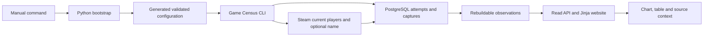

# Game Census — first usable version walkthrough

This file preserves the dated first-usable walkthrough below and records subsequent phase acceptance separately. The [checklist](task_checklist.md) owns current status; [product requirements](../../PRD-game-census.md) and [technical contracts](../../PRS-game-census.md) own the full scope.

## P2 closeout — 2026-09-07

P2 is accepted for the explicitly bounded three-app collection plan. The preserved canary completed 288 cycles and 864 successful attempts, with no failed or uncertain attempts. Its exact window was 2026-09-06 03:35:23.553903 UTC through 2026-09-07 03:35:23.553903 UTC. Coverage included all 259,200 tracked app-seconds and 864 expected occurrences; 259,146.698226 app-seconds were fresh (99.979436%). The target was 95%, with valid sample age below twice the 300-second cadence. Collection was disabled at the end.

This live result belongs to the preserved `p2-canary` image and database, which were not rebuilt or migrated during integration. The current feature branch starts from integration commit `f452810417ab` on `develop`. Current source verification is the separate 360-test suite below. This combination establishes P2's bounded gate; it does not claim a new 24-hour run of the integrated image, explain the earlier worker interruption, or demonstrate P3's next cohort and P5's production capacity.

The closeout fixes the missing diagnostic context exposed by the earlier incident. Four injected failures first reproduced missing interruption context and missing stderr evidence. `scheduler.run` now records bounded exception classes, SQLSTATE, stage and application frame locations. Exception messages, source text, filesystem paths and locals are excluded. A post-dispatch storage failure leaves the attempt uncertain and charged. Failed report finalization emits `report_persisted: false` and stops; it cannot return a success-shaped report.

### P2 commands and unedited evidence

Commands for current source ran from this repository root using the dedicated `p2-integration` instance and synthetic Steam responses. Raw `.txt` files have adjacent `.txt.json` command, working-directory and exit-code metadata.

| Command | Evidence |
|---|---|
| `python tools/dev.py --instance p2-integration test tests/test_scheduler_diagnostics.py` | [Before: 4 failed](evidence/p2-diagnostics-before.txt); [after: 4 passed](evidence/p2-diagnostics-after.txt) |
| `python tools/dev.py --instance p2-integration test` | [360 passed, 2 dependency deprecation warnings, 50.50 seconds](evidence/p2-closeout-suite.txt) |
| `python tools/dev.py --instance p2-integration build` and `start` | [Pinned build](evidence/p2-diagnostics-build-after.txt), [isolated start without collection](evidence/p2-diagnostics-start.txt) |
| Original canary: `python work/final_coverage.py` | [Exact fixed-window output](evidence/p2-canary-final-fixed-coverage-v2.txt); [preserved executed script](evidence/p2-canary-final-coverage-command.py). Original working directory and command remain in adjacent metadata |
| Original canary: `python tools/dev.py --instance p2-canary app report` and `schedule status` | [Retained final run](evidence/p2-canary-final-report.txt), [disabled state](evidence/p2-canary-final-status.txt) |

The canary exports are byte-identical copies of the originating task's files; [export manifest](evidence/p2-canary-export.json) records paths, sizes and SHA-256 checksums. The script deliberately used the retained fixed window, rather than the moving 24-hour status summary.

### P2 acceptance and file purposes

| Requirement | Evidence and limit |
|---|---|
| FR-03, NFR-02: exact history, storage and replay | Current history, rollup, storage, upgrade and recovery cases in the full suite; [integration evidence](../p2-integration/walkthrough.md) retains independent restore/build/browser proof |
| FR-04, NFR-03: quota admission, restart/fencing and real freshness | Current scheduler and virtual-day coverage tests plus all elapsed canary app-time; scope is three apps, not arbitrary capacity |
| FR-10, NFR-01: actionable failures without secrets | Four diagnostic failure cases before/after; existing source failures and recovery cases in the full suite |

Modified `src/game_census/scheduler.py` owns safe interruption/stderr records and protected report finalization. New `tests/test_scheduler_diagnostics.py` owns database-wrapping, uncertain-dispatch and persistence-failure reproductions. Modified `implementation_plan.md`, `agent_prompt.md` and `task_checklist.md` record the authorized P2–P4 continuation, branch, file trace and verified status. Modified `docs/PRS-game-census.md` records the resulting failure contract and links the completed canary. This walkthrough owns completion evidence; new evidence files retain raw commands/results and byte-identical canary exports. No schema, dependency, request policy or acquired observation was removed.

P3/P4 are still pending their complete acceptance. Inspection found no configured `sources.catalog_api_key` in the available local instances; authenticated live catalog/schema checks require that external fact through configuration. Offline implementation can continue. Public release and P5 remain outside this continuation.

## Outcome and scope

The first usable local P0–P1 slice runs at [localhost:8000](http://127.0.0.1:8000). It generates its own configuration and database secret, initializes PostgreSQL, collects a bounded real game, preserves observations, and serves an API and responsive website. The first observation was Dota 2 at 408,400 players; a second manual run recorded 417,478. These are dated Steam responses, not a claim about the current count when this document is read.

The final automated suite produced **136 passed, 2 warnings**. Browser checks exercised real stored data, keyboard navigation, chart inspection, the data table, search, history windows, status, methodology, unknown-game errors and mobile overflow. Two independently built wheels had identical bytes. Full unedited outputs and command metadata are linked below.

This completes the authorized first usable version. It does not complete the full P0–P5 PRD. Scheduled collection, catalog discovery, comparison, full enrichment, backup restoration, release hardening and measured capacity remain future work. No Steam key, model service, public hosting, Git commit or remote was used. The isolated fresh-install check is stopped; the main local instance remains running. Both databases and all test scratch schemas are retained.

## Actual design



The standard-library host wrapper calls a pinned Linux Python image and a digest-pinned PostgreSQL image. The current source version is owned by `src/game_census/__init__.py`; package metadata and the collector User-Agent derive from it. `uv.lock` owns the resolved package graph. `requirements.lock` and `.python-version` have shipped regeneration/check commands.

The collector reserves durable request attempts before sending, serializes manual collectors, records source outcomes separately, and treats partial runs as nonzero exits. Retry-After cooldowns survive subsequent manual runs. Captures retain checksums and parser/source versions. Current-player responses are canonical payload captures; Store metadata is explicitly a name-only allowlisted capture. Page views read PostgreSQL only.

The first migration installs the bounded capture/observation/identity/attempt/run/tracking schema. The second adds source cooldown events. Both are additive and initialization is repeatable. Previously enrolled games stay visible when collection configuration changes. Time-weighted averages include only cadence-capped covered time; coverage uses the entire requested window. Historical periods are never invented or refetched.

## Decisions and plan deviations

- Kept the proposed Python/FastAPI/PostgreSQL stack. Exact tested pins are in the checked-in locks, including Python 3.14.6 and PostgreSQL 18.4.
- Pulled manual quota accounting, bounded history, name-only identity enrichment and a useful read website into the first slice. Their broader phase tasks remain open.
- Used native SVG and local JavaScript/CSS instead of adding ECharts for the initial bounded series. The same points are available in an HTML table and JSON.
- Kept one database role and the test toolchain in the local image. Separate least-privilege roles and a production runtime image remain release work.
- Installed the original plan's Apache-2.0 code default from the [Apache license source](https://www.apache.org/licenses/LICENSE-2.0.txt). This does not license Steam data or approve public branding/distribution.
- Replaced the exporter's old plan-only guard, whose purpose was to prevent unsupported completion claims before implementation. The new guard accepts explicit partial roadmap progress and requires an evidence walkthrough for completed tasks. The source archive now includes actual runtime files.
- The reproducibility claim is about the wheel's exact bytes. Docker attestation timestamps and host/runtime caches are outside that comparison.

## Verification evidence

Commands below ran from the repository root. Each linked `.txt` is unedited combined command output; adjacent `.txt.json` files record the exact argument array, working directory and exit code where a command was captured by the root recorder. The browser row gives its portable reproduction command; its [recorded invocation](evidence/final-browser-check.txt.json) retains the original screenshot output directory. Earlier failed attempts remain evidence and have not been overwritten by passing output.

| Verification | Command | Observed result and raw output |
|---|---|---|
| Final full suite | `python tools/dev.py test` | [136 passed, 2 warnings](evidence/final-tests.txt); includes 12 PostgreSQL integration checks |
| Fresh configuration/volume to real web output | `python tools/dev.py --instance first-usable-check quickstart --once --app-id 570 --port 8001` | [Zero captures before collection; two source captures; HTTP-ready URL](evidence/fresh-install.txt) |
| Additive upgrade, unchanged acquired history | `python tools/dev.py start` | [Schema version 2; two retained captures before second run; healthy web](evidence/final-start.txt) |
| Second real manual sample | `python tools/dev.py app collect --once` | [Two bounded requests succeeded; 417,478 received at 2026-09-05 02:04:39 UTC](evidence/second-live-collection.txt) |
| Replay live canonical data | `python tools/dev.py app aggregate rebuild` | [Four captures replayed, four projections verified, canonical history unchanged](evidence/replay-live.txt) |
| Final desktop/mobile journey | `uv run --frozen python tools/browser_check.py` | [Fourteen journey checks, no browser errors or external page requests](evidence/final-browser-check.txt); original arguments in adjacent invocation metadata |
| Lock ownership | `python tools/sync_toolchain.py --check` | [Python selector and hashed requirements match canonical locks](evidence/toolchain-check-after.txt) |
| Canonical build equality | `python tools/repro_build.py` | [Two identical wheels; runtime schema/templates/assets present](evidence/final-reproducible-build.txt) |

Final wheel SHA256: `aa5739abd882d95cb77a4acb84ffafe796dc8950d825f2d17e660fd390dfc7b2`.

The two test warnings originate in the pinned Starlette test client: httpx integration and an anyio alias are deprecated. They are retained in the output. Docker emits an `InvalidDefaultArgInFrom` warning because its base argument intentionally has no floating default; the shipped wrapper always supplies the locked image digest. Neither warning was hidden or relabeled as a failure.

The packet validator uses `docs` as its artifact root so the canonical PRD and nested build packet remain within one validation boundary. Its explicit PRD/plan/checklist/brief/walkthrough arguments preserve the existing document ownership; the old PRD pointer is not duplicated into a second requirements document. [Final packet validation output](evidence/packet-validation.txt).

The live source calls covered one game per instance. Tests use synthetic fixtures in uniquely named PostgreSQL schemas, not fake data in the live pages. The browser run included 1440×1080 and 390×844 viewports, Tab/Enter to the skip link, chart arrow keys, an expanded observation table, and visible error navigation. Screenshots were saved by the command and visually inspected. The page exposes horizontal scrolling inside its data tables on narrow screens without widening the page.

## Reproduced defects and repairs

| Defect | Before/after evidence | Repair |
|---|---|---|
| Empty game list silently became the default; boolean schema version passed; duplicate key lacked its name | [Configuration failures](evidence/config-check-before.txt), [passing full suite](evidence/final-tests.txt) | None-only defaulting, strict schema-version type, safe named duplicate diagnostic |
| Docker accepted a loopback-only container bind | [Failing wrapper check](evidence/config-driver-bind-before.txt), [passing check](evidence/config-driver-bind-after.txt) | Validate effective `web.bind` before Compose uses it |
| Healthy database could be mistaken for healthy HTTP | [Failing HTTP-doctor checks](evidence/config-doctor-http-before.txt), [passing full suite](evidence/final-tests.txt) | `doctor --http` verifies actual local readiness; Compose uses it |
| Captured configuration diagnostics lost setting names | [Failing safe-diagnostic checks](evidence/config-captured-diagnostic-before.txt), [passing full suite](evidence/final-tests.txt) | Forward only the CLI's authored safe JSON diagnostic; suppress arbitrary credential-bearing Docker output |
| History included a sample exactly at its exclusive end | [Failing unit](evidence/backend-boundary-unit-before.txt), [passing unit](evidence/backend-boundary-unit-after.txt), [failing SQL](evidence/backend-boundary-database-before.txt), [passing SQL](evidence/backend-boundary-database-after.txt) | Use `< end` in metrics and both SQL selection/count predicates |
| Open-page freshness labels implied current state | [Failing snapshot test](evidence/web-snapshot-before.txt), [passing snapshot test](evidence/web-snapshot-pass.txt) | Label badges/totals “Fresh at page read”; retain refresh notice and user focus |
| Tool version check rejected legitimate uv build metadata | [Failing lock check](evidence/toolchain-check.txt), [passing same check](evidence/toolchain-check-after.txt) | Compare the exact version field separately from build metadata |

Source tests also cover malformed or unsupported responses, genuine zero, timeouts, body limits, blocked redirects/hosts, retry reporting, invalid Retry-After, partial metadata outcomes and shared cooldown admission. Review repairs were followed by the same targeted reproduction command and the final integrated suite.

## Acceptance matrix

| Requirement | Status at this handoff | Evidence / boundary |
|---|---|---|
| FR-01 | First-slice acceptance met | Generated empty-state setup, explicit configuration failures, CLI, fresh-install output; no manual SQL or secret placement |
| FR-02 | First-slice acceptance met | Actual current players, durable captures, zero/error distinction, source timestamp and last-attempt state |
| FR-03 | Implemented subset | Recorded peaks/history/coverage/weighted average and replay verified; growth, long-term rollups and broader history workload remain future |
| FR-04 | Implemented foundation only | Manual admission/attempt/cooldown checks pass; no scheduler or watched-enable workflow exists |
| FR-05 | Future full capability | Enrolled-game text/ID search exists; catalog discovery/reconciliation is absent |
| FR-06 | Implemented subset | Responsive read pages, keyboard chart/table, bounds and error states verified; comparison and enrichment surfaces remain future |
| FR-07 | Name-only subset | Optional source identity and partial failure behavior; no price or full metadata capability |
| FR-08 | Future | Review summaries not collected by the application |
| FR-09 | Future | Achievements and news not collected |
| FR-10 | Implemented subset | Run reports, HTTP/database status and capture replay; full backup/restore, archives and operational release reports absent |
| NFR-01 | Local-slice checks met | Validated config/query/source bounds, fixed hosts, escaping, safe diagnostics, loopback publication; public hardening remains future |
| NFR-02 | Local-slice checks met | Idempotent initialization, retained canonical payloads, atomic persistence, deterministic projections and correct time boundaries; full restore proof remains future |
| NFR-03 | Not claimed | No full-catalog freshness, benchmark throughput, latency target or 90-day capacity claim |
| NFR-04 | Local build checks met | Locked runtime/packages, local assets, frozen installation, source license default and identical wheels; public CI/release review remains future |

## Changed files and purposes

All application/tool/test/build files below are new in the previously planning-only repository. Existing planning documentation and its exporter were updated after their contents were backed up and restored into scratch with matching checksums. No canonical observation, database column, existing code feature or user setting was deleted.

| Paths | Action and purpose |
|---|---|
| `pyproject.toml`, `uv.lock`, `requirements.lock`, `.python-version`, `build/toolchain.lock.json` | NEW: package entry point, version derivation, exact dependencies, hashes and runtime/build pins |
| `Dockerfile`, `compose.yaml`, `.dockerignore` | NEW: bounded local image/services, retained database volume, HTTP healthcheck and build-context allowlist |
| `LICENSE` | NEW: planned Apache-2.0 code license text |
| `.gitignore` | MODIFY: exclude secrets, runtime data, dependency/test caches and generated artifacts |
| `src/game_census/__init__.py`, `__main__.py`, `cli.py`, `config.py` | NEW: release identity, module execution, direct commands and canonical validation/generation schema |
| `src/game_census/db.py` | NEW: safe PostgreSQL transactions, migration locks, ledgers, bounded read models, cooldowns and replay verification |
| `src/game_census/collector.py` | NEW: bounded manual collection and explicit per-source/per-run outcomes |
| `src/game_census/projections.py`, `metrics.py` | NEW: deterministic parsing into observations and half-open coverage/average calculations |
| `src/game_census/sources/__init__.py`, `base.py`, `http.py`, `players.py`, `store.py` | NEW: fixed registry/contracts, safe bounded HTTPS and the two source adapters |
| `src/game_census/migrations/001_initial.sql`, `002_source_cooldown.sql` | NEW: additive retained-state schema and durable cooldown events |
| `src/game_census/web.py`, `contracts.py` | NEW: read-only routes, typed OpenAPI/response contracts, safe rendering and error handling |
| `src/game_census/templates/base.html`, `index.html`, `game.html`, `status.html`, `methodology.html`, `error.html`, `_state.html`, `_chart.html` | NEW: navigation, activity/detail, operations/methodology, explicit failures and reusable state/chart presentation |
| `src/game_census/static/app.css`, `app.js` | NEW: responsive local styles, keyboard/pointer chart inspection and stored-state refresh notices |
| `tests/test_config_cli.py`, `test_sources.py`, `test_history.py`, `test_bootstrap.py`, `test_recovery.py`, `test_api.py`, `test_ui.py` | NEW: boundary, source, analytical, persistence, ledger/replay, HTTP and template regression checks |
| `tools/dev.py` | NEW: direct Docker bootstrap, build, start/stop/status, app and test commands |
| `tools/browser_check.py`, `repro_build.py`, `sync_toolchain.py` | NEW: browser journey/screenshot evidence, identical-wheel proof and derived-lock regeneration/checks |
| `tools/export_plan.py` | MODIFY: scope-aware progress validation and deterministic source/document export; prevents overwrite of different deliverables |
| `README.md` | MODIFY: replace planning-only navigation with actual setup, collection, configuration, test and limit instructions |
| `docs/PRD-game-census.md`, `docs/PRS-game-census.md` | MODIFY: preserve full requirements, identify actual first-slice contracts and distinguish future targets |
| `docs/build-tasks/initial-release/implementation_plan.md`, `task_checklist.md`, `agent_prompt.md` | MODIFY: current commands/files, authorized stopping point, evidence-backed first-slice progress and remaining roadmap |
| `docs/build-tasks/initial-release/walkthrough.md` | NEW: this handoff and evidence interpretation |
| `docs/build-tasks/initial-release/evidence/*.txt`, `*.txt.json` added during implementation | NEW: named command outputs and adjacent invocation metadata; each is an immutable record, not a competing requirements source |

The original `tools/probe_sources.py`, backlog and planning/source evidence remain historical inputs. Their old statements about unstarted application work describe the dated planning stage. They do not override the current checklist or this walkthrough.

## Known limitations and operation

From the repository root, `python tools/dev.py quickstart --once --app-id 570` is the fresh-start path. On this already running instance, use `python tools/dev.py app collect --once` for the next observation. Use `python tools/dev.py app config describe --schema` for supported configuration names and bounds. `python tools/dev.py stop` and `start` retain the database and configuration.

The source registry is fixed, and no Steam credential is needed for these two endpoints. Steam can refuse or change public responses; the next bounded run reports that failure and retains the last valid observation. Manual-only collection naturally becomes stale and produces visible gaps. A fresh receipt does not prove Steam's internal cache is equally fresh.

`aggregate rebuild` validates retained captures and projections; it is not disaster recovery. No backup archive, deletion command or retention purge is shipped. A full tested scratch restore is still required before any future destructive storage operation or public release. No full-data capacity test has been run. Review the original PRD/PRS and remaining checklist before expanding scope or enabling schedules.

## Reviewer quick check

```powershell
python tools/dev.py status
python tools/dev.py test
python tools/dev.py app aggregate rebuild
uv run --frozen python tools/browser_check.py
python tools/sync_toolchain.py --check
python tools/repro_build.py
```

These commands inspect the existing local installation, exercise retained scratch test schemas, or build derived artifacts. Only an explicit `collect --once` or `quickstart --once` makes a new Steam observation. Future work starts from the remaining checklist; it must preserve this running end-to-end path.
