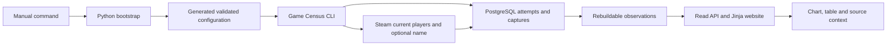

# Game Census — first usable version walkthrough

This file preserves the dated first-usable walkthrough below and records subsequent phase acceptance separately. The [checklist](task_checklist.md) owns current status; [product requirements](../../PRD-game-census.md) and [technical contracts](../../PRS-game-census.md) own the full scope.

## P3 live cohort canary — 2026-09-08

The next P3 acceptance run is prepared on the same dedicated instance. A private copy of the local configuration was restored into scratch and compared byte-for-byte and through typed settings before updating operator values. Pins are 440/570, cohort selection is enabled, the HTTP timeout is 10 seconds and the worker duration bound is 86,400 seconds. Other policy bounds remain unchanged. Initialization enrolled the pins and the shipped reconciliation command adopted catalog app 10 as the one explorer. No source request occurred during adoption; it is canonical cohort event 1.

| Command | Unedited evidence |
|---|---|
| Configuration preparation; exact script invocation in adjacent command metadata | [Verified private configuration restore and changed settings](evidence/p3-live-cohort-config.txt) |
| `python tools/dev.py --instance p2-integration app initialize` | [Two pins enrolled, scheduler disabled](evidence/p3-live-cohort-initialize.txt) |
| `python tools/dev.py --instance p2-integration app cohort reconcile --once --dry-run` | [Admitted preview; no source calls](evidence/p3-live-cohort-preview.txt) |
| `python tools/dev.py --instance p2-integration app cohort reconcile --once --apply` | [Adoption event 1: apps 10/440/570](evidence/p3-live-cohort-adopt.txt) |
| `python tools/dev.py --instance p2-integration app schedule plan` | [Six jobs, 249-second worst-case cycle, admitted shared quotas/reserves](evidence/p3-live-cohort-schedule-plan.txt) |
| `python tools/dev.py --instance p2-integration app collect --once` | [First manual run: six source successes](evidence/p3-live-cohort-manual.txt). The operator subsequently requested another run to watch in the browser; this run has no watched acknowledgment |
| `python tools/dev.py --instance p2-integration app collect --once` | [Requested repeat: six source successes](evidence/p3-live-cohort-manual-repeat.txt), run `9bba8647-b9c3-4519-ad66-783da6c7d3fd`. The user then confirmed, “Yes, I watched this run end to end” |
| `docker exec game-census-p2-integration-web-1 python -m game_census doctor --http` | [Refreshed serving process, three tracked apps, seven captures and scheduler disabled](evidence/p3-live-cohort-http-ready.txt) |
| `docker stats --no-stream --format '{{json .}}' game-census-p2-integration-db-1 game-census-p2-integration-web-1` | [Pre-canary resource snapshot](evidence/p3-live-cohort-resources-before.txt); database usage includes previously retained scratch schemas and the snapshot is not a sustained measurement |
| `python tools/dev.py --instance p2-integration app schedule acknowledge --watched --run-id 9bba8647-b9c3-4519-ad66-783da6c7d3fd` | [Recorded watched acknowledgment](evidence/p3-live-cohort-acknowledge.txt), after the user's confirmation |
| `python tools/dev.py --instance p2-integration app schedule enable` | [Enabled the matching plan](evidence/p3-live-cohort-enable.txt) |
| `python -u tools/dev.py --instance p2-integration app schedule run --max-cycles 288` | [Hidden worker launch metadata](evidence/p3-live-cohort-worker-launch.json); full stdout/stderr remain in its declared output directory until completion |
| `python tools/dev.py --instance p2-integration app schedule status` | [Epoch 1 enabled at `2026-09-08T00:03:55.404308Z`; first six jobs succeeded](evidence/p3-live-cohort-initial-status.txt) |
| `docker stats --no-stream --format '{{json .}}' game-census-p2-integration-db-1 game-census-p2-integration-web-1 game-census-p2-integration-web-run-4e8f92a56870` | [Initial running resource sample](evidence/p3-live-cohort-resources-initial.txt), including the bounded worker |

The admitted plan hash is `ee322702df2b0a3105f8f2b47c647c85c4c483c244f0450a394bf93036f0c3a7`. The bounded worker is running the tested image from source commit `27bc365`. Its fixed canary window is `[2026-09-08T00:03:55.404308Z, 2026-09-09T00:03:55.404308Z)`, with 259,200 tracked app-seconds and 864 expected player occurrences. Missing/failed app-time stays in the denominator. The first cycle's 100% fresh app-time is only an initial observation, not the 24-hour acceptance result. Name-only Store outcomes and resource observations will be reported separately. No cohort or runtime configuration changes are permitted during this measurement.

Hourly task heartbeat `game-census-p3-canary` checks the worker, records resource and operation evidence, and reports meaningful failure or completion. At or after the fixed deadline it must disable scheduling, verify worker completion, preserve the full logs and assess exact fixed-window freshness before closing P3 or starting P4. The worker inherits the web container's HTTP healthcheck, so its `unhealthy` HTTP flag alone is not a collection failure; it does not serve HTTP. Use its process state, retained job progress and source outcomes, while requiring the separate web/database services to remain healthy. This operational limitation remains distinct from measured collection success.

## P3 authenticated catalog validation — 2026-09-07

The operator supplied `sources.catalog_api_key` in ignored local configuration. Steam accepted the authenticated catalog request. The first two attempts encountered a local foreign-key failure and remain charged and uncertain; the successful retry retained one canonical page containing 1,000 games and checkpoint cursor 65980. The scan remains partial, with no completed watermark. Scheduling is disabled and tracking remains app 570. This closes the bounded authenticated catalog gate, not next-cohort freshness or P4 acceptance.

The cause was an older empty-database cutover: `discovery_snapshot` still referenced `capture_legacy_004`, whose frozen contents cannot include new captures. That foreign key enforced source-capture existence against the former ledger. Migration 009 validates the equivalent constraint against the current `capture_identity` before removing the obsolete reference, within initialization's transaction. It preserves both capture tables, all observations and charged attempts, skips legacy layouts and tolerates repeat initialization. Before changing the live schema, backup `backup-f698daf419a044d6b17bcd3155cc10b4` was restored into a new read-only scratch database with all 32 table manifests verified.

The existing scheduler diagnostic formatter moved to `diagnostics.exception_context`, retaining its limits and allowlist. Catalog reports now record the failed stage, exception classes, application code locations and SQLSTATE without exception messages, payloads, local variables or credentials. Failed report persistence emits that context on stderr. Synthetic database settings explicitly clear the operator's key; authenticated test cases supply their own fixture value. This prevents a real local credential from changing missing-key test expectations or entering mocked requests.

### Commands and unedited evidence

Commands ran from the feature worktree on `codex/feat-p2-p4`, based on `771b154`. Each output's adjacent `.txt.json` records the exact command, cwd and exit status.

| Command | Evidence |
|---|---|
| `python tools/dev.py --instance p2-integration test tests/test_catalog.py` | [Before: 4 failed, 22 passed](evidence/p3-key-repair-before.txt); [after: 26 passed](evidence/p3-key-repair-after.txt). Reproduces the historical reference failure, missing durable/stderr diagnostics and operator-key-dependent test |
| `python tools/dev.py --instance p2-integration test` | [471 passed, 2 existing dependency warnings, 91.58 seconds](evidence/p3-key-repair-suite.txt), including scheduler diagnostics, historical-layout migration and native recovery |
| `python tools/dev.py --instance p2-integration app backup create` | [Immutable local snapshot](evidence/p3-key-repair-backup.txt) |
| `python tools/dev.py --instance p2-integration app backup restore --backup-id backup-f698daf419a044d6b17bcd3155cc10b4` | [All 32 tables verified in a new scratch database](evidence/p3-key-repair-restore.txt), before live schema repair |
| `python tools/dev.py --instance p2-integration build` and `start` | [Tested pinned image](evidence/p3-key-repair-build-after.txt); [live schema 9, healthy containers, scheduler disabled](evidence/p3-key-repair-start.txt) |
| `python tools/dev.py --instance p2-integration app catalog sync --once --max-pages 1` | [One successful source request; 1,000 retained entries](evidence/p3-key-repair-live.txt). Exit 1 intentionally signals the unfinished overall scan; the wrapper also prints its generic nonzero-command diagnostic |
| `python tools/dev.py --instance p2-integration app catalog status` | [Retained cursor and scan identity](evidence/p3-key-repair-status.txt); no completed watermark |
| `python tools/dev.py --instance p2-integration app doctor` | [One capture, three charged attempts, two prior uncertain attempts, scheduler disabled](evidence/p3-key-repair-database.txt) |
| `docker exec game-census-p2-integration-web-1 python -m game_census doctor --http` | [HTTP ready and database/configuration healthy](evidence/p3-key-repair-http.txt). The earlier [one-off container check](evidence/p3-key-repair-doctor.txt) addressed its own empty localhost; the HTTP check must run in the serving container |

The final live run is `0fd312b9-dfb7-42a1-98bf-0a8c808385c6`, capture `c75adfe9-8590-41e9-8815-8d5f95d89d5b`, received at `2026-09-07T23:45:56.067711+00:00`. FR-05 has bounded authenticated capture/checkpoint evidence; NFR-01 has safe failure diagnostics and bounded dispatch; NFR-02 has before/after regression and verified restore evidence. No claim is made that a person watched the next cohort or that this one-page request measured sustained freshness.

### Changed files

| Files | Purpose |
|---|---|
| `src/game_census/migrations/009_catalog_reference.sql` | NEW versioned, validated repair of the obsolete catalog reference |
| `src/game_census/diagnostics.py`, `scheduler.py`, `catalog.py` | NEW shared exception formatter; preserve scheduler behavior and make catalog failures diagnosable |
| `tests/test_catalog.py` | Reproduce old empty-upgrade state and verify persistence, replay, restore and redacted failures |
| `tests/test_bootstrap.py`, `tests/test_p2_integration.py` | Isolate synthetic keys from operator settings and require schema 9 on historical upgrades |
| This walkthrough, implementation plan, checklist and execution brief | Reconcile the discovered repair, live source gate and remaining cohort work |
| `evidence/p3-key-repair-*` | Raw command output and exact command metadata, including failures |

## P3 cohort increment — 2026-09-07

This increment implements explicit cohort adoption on `codex/feat-p2-p4`, after read-service commit `4f7fdb16bc24`. The source suite reports **468 passed, 2 dependency deprecation warnings, 81.38 seconds**. These are synthetic Steam tests in retained isolated PostgreSQL schemas, including native backup/restore. They establish the implementation increment, not authenticated catalog availability, the next watched live cohort, P4 completion or public-release readiness.

Configuration remains the owner of operator policy and pinned IDs. The append-only application interface records membership decisions in `cohort_event`, with policy hashes, dated roles, bounded candidate IDs and retained player-capture references. `tracking_interval` and `tracking_stop` own acquired tracking extent; stopping or reopening never deletes observations. Runtime collection, scheduler admission and rankings resolve the adopted membership. Changed policy fails closed; an explicit disabled-policy adoption closes exploration tracking before static collection resumes. Adoption itself makes no Steam request and cannot enable scheduling.

Repeated fresh observations and separate promotion/demotion thresholds provide hysteresis. Residence/reconciliation intervals and per-adoption replacement limits bound churn. A wrapping catalog cursor reserves exploration. Capacity includes discovery attempts and extra watched runs for changed cohorts, using the existing shared rolling quotas and serialized worker bound. First adoption includes preexisting open static intervals in its bounded baseline: unpinned games become active members or receive explicit stop events if configured capacity is reduced. Baseline interval IDs remain in the adoption basis. The default remains static app configuration. Status, search, summaries and comparisons show stopped tracking while retaining historical data. The derived `latest_app_name` view prevents a later generated enrollment label from hiding an acquired Steam name.

### Cohort commands and unedited evidence

All commands below ran from the feature worktree. Each raw text output has an adjacent `.txt.json` containing exact arguments, cwd and exit code. Intermediate failures remain retained rather than rewritten as passing output.

| Command | Evidence and result |
|---|---|
| `.venv/Scripts/python.exe -m pytest tests/test_cohort.py -q -m 'not integration'` | [Before: oversized reduced-capacity proposal](evidence/p3-cohort-policy-before.txt); [after: 28 passed](evidence/p3-cohort-policy-after.txt) |
| `python tools/dev.py --instance p2-integration test tests/test_cohort.py::test_tracking_start_comes_from_its_interval_not_app_identity_creation tests/test_cohort.py::test_stop_and_reopen_change_warm_tracking_coverage_without_deleting_history` | [Before: 2 failed](evidence/p3-cohort-interval-before.txt); [after: 2 passed](evidence/p3-cohort-interval-after.txt). Actual interval start replaces app creation time; the tracking-stop trigger invalidates warm derived coverage and the same history command rebuilds it correctly |
| `python tools/dev.py --instance p2-integration test tests/test_cohort.py::test_disabling_policy_requires_reconciliation_before_collecting tests/test_cohort.py::test_disabled_reconciliation_stops_explorers_and_preserves_pinned_tracking` | [Before: 2 failed](evidence/p3-cohort-disable-before.txt); [after: 2 passed](evidence/p3-cohort-disable-after.txt) |
| `python tools/dev.py --instance p2-integration test tests/test_cohort.py::test_enrollment_preserves_discovered_game_name` | [Reproduction: 2 failed](evidence/p3-cohort-names-reproduced.txt); [after: 2 passed](evidence/p3-cohort-names-after.txt). The earlier `names-before` record is a test syntax error, not bug reproduction evidence |
| `python tools/dev.py --instance p2-integration test tests/test_cohort.py::test_first_adoption_accounts_for_preexisting_static_tracking` | [Before: 2 failed](evidence/p3-cohort-baseline-before.txt); [after: 2 passed](evidence/p3-cohort-baseline-after.txt). First adoption no longer omits preexisting unpinned tracking or leaves its removed interval open |
| `python tools/dev.py --instance p2-integration test` | [Final suite: 468 passed](evidence/p3-cohort-suite-final.txt). The prior [460-passed run](evidence/p3-cohort-suite-first.txt) exposed a missing new read method on the in-memory test ledger; its original failure checks remain intact |
| `.venv/Scripts/python.exe tools/browser_read_check.py --cohort-only --output-dir docs/build-tasks/initial-release/evidence/p3-cohort-browser` | [Chromium output](evidence/p3-cohort-browser-first.txt): roles, retained stopped history, changed-policy notice, keyboard and mobile layout; zero collection attempts, external requests and browser errors |
| `python tools/dev.py --instance p2-integration build` and `start` | [Pinned build](evidence/p3-cohort-build-v2.txt), [dedicated instance start](evidence/p3-cohort-start-v2.txt). Build retains the two existing Docker base-argument warnings; no dependency versions were changed |

The cohort integration cases also verify read-only previews, atomic rollback after an injected tracking-write failure, contention with the collection lock, new database-object restart, stale-preview rejection, current adopted targets in manual and scheduled runs, acknowledgment invalidation when targets change, bounded cursor fairness, retained samples after removal, full manifest equality after native restore and rejection of a corrupted adoption checksum. Mocked scheduler attestations in tests are fixtures and do not authorize a real schedule.

Visual inspection covered [desktop status](evidence/p3-cohort-browser/cohort-desktop.png), [mobile status](evidence/p3-cohort-browser/cohort-mobile.png) and [stopped mobile profile](evidence/p3-cohort-browser/stopped-profile-mobile.png). Role/status tables and history labels remain readable at 390 pixels with no root-page horizontal overflow. Existing chart and polling lifecycle behavior was retained.

### Cohort file responsibilities

| File | Purpose of this change |
|---|---|
| `src/game_census/cohort.py` | New bounded deterministic selection, stored-input plan, checksummed adoption, runtime resolution and safe public status |
| `src/game_census/config.py` | Typed opt-in policy, bounds and private preservation of original pinned IDs in resolved settings |
| `src/game_census/migrations/008_cohort.sql` | Additive adoption/stop ledgers, stop-driven cache invalidation and derived canonical name-selection view |
| `src/game_census/cli.py` | Register plan/status/reconcile, bootstrap schema before resolving membership, disclose write/request bounds and guard worker configuration changes |
| `src/game_census/collector.py`, `scheduler.py` | Use adopted targets, reject unreconciled changes, serialize adoption with collection and include discovery/replacement reserves in admission |
| `src/game_census/db.py`, `cache.py` | Preserve/resolve start/end history, reopen intervals, rebuild coverage after stops and share acquired-name selection |
| `src/game_census/contracts.py`, `queries.py`, `web.py` | Typed cohort/stop fields, adopted rankings and safe selected-versus-retained status counts |
| `src/game_census/templates/_state.html`, `game.html`, `compare.html`, `search.html`, `status.html` | Disclose stopped tracking, retained history, selected roles and policy mismatch |
| `tests/test_cohort.py` | Forty-two policy, runtime, CLI, history, upgrade-baseline, source-name and native restore checks with synthetic inputs |
| `tests/test_api.py`, `test_sources.py`, `test_config_cli.py`, `test_p2_integration.py` | Extend fixture read/bootstrap interfaces and require schema 8 while preserving original source/error/upgrade assertions |
| `tools/browser_read_check.py` | Bounded cohort-only Chromium fixture, keyboard/mobile checks and screenshots without source collection |
| `README.md`, `docs/PRS-game-census.md`, packet plan/brief/checklist/walkthrough | Explain shipped commands/contracts, file trace, exact evidence and remaining live acceptance |
| New `evidence/p3-cohort*` files | Immutable command outputs, invocation metadata and derived browser screenshots |

The dedicated instance remained on app 570, zero captures and disabled scheduling after schema 8 startup. [HTTP smoke output](evidence/p3-cohort-http-smoke.txt) records seven successful local routes. The later baseline-only correction was covered by the final full suite and restarted with the same static configuration.

No frozen legacy-copy change was needed in `storage.py`: its capture projections remain the same, while full native backup/restore already inventories the additive canonical ledgers. Full-suite legacy upgrade/cutover and restore cases include schema 8. The next phase action remains the live gates in the checklist; no PR is requested.

## P2 closeout — 2026-09-07

P2 is accepted for the explicitly bounded three-app collection plan. The preserved canary completed 288 cycles and 864 successful attempts, with no failed or uncertain attempts. Its exact window was 2026-09-06 03:35:23.553903 UTC through 2026-09-07 03:35:23.553903 UTC. Coverage included all 259,200 tracked app-seconds and 864 expected occurrences; 259,146.698226 app-seconds were fresh (99.979436%). The target was 95%, with valid sample age below twice the 300-second cadence. Collection was disabled at the end.

This live result belongs to the preserved `p2-canary` image and database, which were not rebuilt or migrated during integration. The current feature branch starts from integration commit `f452810417ab` on `develop`. Current source verification is the separate 360-test suite below. This combination establishes P2's bounded gate; it does not claim a new 24-hour run of the integrated image, explain the earlier worker interruption, or demonstrate P3's next cohort and P5's production capacity.

The closeout fixes the missing diagnostic context exposed by the earlier incident. Four injected failures first reproduced missing interruption context and missing stderr evidence. `scheduler.run` now records bounded exception classes, SQLSTATE, stage and application frame locations. Exception messages, source text, filesystem paths and locals are excluded. A post-dispatch storage failure leaves the attempt uncertain and charged. Failed report finalization emits `report_persisted: false` and stops; it cannot return a success-shaped report.

### P2 commands and unedited evidence

Commands for current source ran from this repository root using the dedicated `p2-integration` instance and synthetic Steam responses. Raw `.txt` files have adjacent `.txt.json` command, working-directory and exit-code metadata.

| Command | Evidence |
|---|---|
| `python tools/dev.py --instance p2-integration test tests/test_scheduler_diagnostics.py` | [Before: 4 failed](evidence/p2-diagnostics-before.txt); [after: 4 passed](evidence/p2-diagnostics-after.txt) |
| `python tools/dev.py --instance p2-integration test` | [360 passed, 2 dependency deprecation warnings, 50.50 seconds](evidence/p2-closeout-suite.txt) |
| `python tools/dev.py --instance p2-integration build` and `start` | [Pinned build](evidence/p2-diagnostics-build-after.txt), [isolated start without collection](evidence/p2-diagnostics-start.txt) |
| Original canary: `python work/final_coverage.py` | [Exact fixed-window output](evidence/p2-canary-final-fixed-coverage-v2.txt); [preserved executed script](evidence/p2-canary-final-coverage-command.py). Original working directory and command remain in adjacent metadata |
| Original canary: `python tools/dev.py --instance p2-canary app report` and `schedule status` | [Retained final run](evidence/p2-canary-final-report.txt), [disabled state](evidence/p2-canary-final-status.txt) |

The canary exports are byte-identical copies of the originating task's files; [export manifest](evidence/p2-canary-export.json) records paths, sizes and SHA-256 checksums. The script deliberately used the retained fixed window, rather than the moving 24-hour status summary.

### P2 acceptance and file purposes

| Requirement | Evidence and limit |
|---|---|
| FR-03, NFR-02: exact history, storage and replay | Current history, rollup, storage, upgrade and recovery cases in the full suite; [integration evidence](../p2-integration/walkthrough.md) retains independent restore/build/browser proof |
| FR-04, NFR-03: quota admission, restart/fencing and real freshness | Current scheduler and virtual-day coverage tests plus all elapsed canary app-time; scope is three apps, not arbitrary capacity |
| FR-10, NFR-01: actionable failures without secrets | Four diagnostic failure cases before/after; existing source failures and recovery cases in the full suite |

Modified `src/game_census/scheduler.py` owns safe interruption/stderr records and protected report finalization. New `tests/test_scheduler_diagnostics.py` owns database-wrapping, uncertain-dispatch and persistence-failure reproductions. Modified `implementation_plan.md`, `agent_prompt.md` and `task_checklist.md` record the authorized P2–P4 continuation, branch, file trace and verified status. Modified `docs/PRS-game-census.md` records the resulting failure contract and links the completed canary. This walkthrough owns completion evidence; new evidence files retain raw commands/results and byte-identical canary exports. No schema, dependency, request policy or acquired observation was removed.

P3/P4 are still pending their complete acceptance. Inspection found no configured `sources.catalog_api_key` in the available local instances; authenticated live catalog/schema checks require that external fact through configuration. Offline implementation can continue. Public release and P5 remain outside this continuation.

## P3 catalog lifecycle increment — 2026-09-07

The keyed catalog now supports bounded full, incremental and resumed scans through shipped plan/status/sync/dry-run commands. Configuration owns page size, included types, per-run limits, refresh interval and overlap. `steam_catalog_v2` retains modification timestamps and price-change tokens alongside names and IDs; v1 remains registered so existing captures replay unchanged. Source field semantics follow the [Valve catalog reference](https://partner.steamgames.com/doc/webapi/IStoreService), inspected on this date. A token change indicates that price may have changed; it is not an observed price.

Each v2 capture stores secret-free scan identity, start time, mode and request policy in its canonical parameters. Migration 7 adds derived `source_policy` and `catalog_checkpoint` tables. Page projection and checkpoint share one transaction. A failed or unfinished scan preserves the last complete watermark; incremental queries overlap the completed scan-start timestamp. Periodic full reconciliation retains absent identities, and a reappearing app receives its newly captured name. A page-limit stop reports partial progress and exits nonzero. The original collector's latest-page branch was replaced by the dedicated service; old parser behavior is retained for historical replay.

### Catalog verification

Current-source commands ran from the repository root on the isolated `p2-integration` instance. Steam responses were synthetic; initialization and dry-run performed zero upstream requests. `.txt.json` files retain exact commands and exit codes.

| Command | Unedited result |
|---|---|
| `python tools/dev.py --instance p2-integration test tests/test_catalog.py tests/test_discovery.py tests/test_p2_integration.py` | [44 passed](evidence/p3-catalog-first.txt), including 22 new catalog cases |
| `python tools/dev.py --instance p2-integration test` | [382 passed, 2 dependency deprecation warnings, 55.89 seconds](evidence/p3-catalog-suite-first.txt) |
| `python tools/dev.py --instance p2-integration test tests/test_catalog.py::test_legacy_catalog_and_new_checkpoints_survive_verified_partition_cutover` | [One additional migration case passed](evidence/p3-catalog-migration.txt), added after the full-suite run |
| `python tools/dev.py --instance p2-integration app initialize` | [Migration 7; zero captures; scheduler disabled](evidence/p3-catalog-initialize.txt) |
| `python tools/dev.py --instance p2-integration app catalog sync --once --dry-run --max-pages 1` | [One-page scope, missing-key state, no collection](evidence/p3-catalog-dry-run.txt) |

The tests include nonadvancing/repeated/unsorted pages, invalid optional fields, resumed cursor/filter identity, stale completed watermark, failed-first-page restart, post-checkpoint rollback, periodic full scans, absence/reappearance, invalid configuration and read-only CLI behavior. Scratch restore checks all projections. The additional migration case combines old main's layout, v1 catalog and player captures, new v2 checkpoints, verified partition cutover and legacy-copy regeneration.

### Catalog file purposes and remaining work

| File | Responsibility/change |
|---|---|
| `src/game_census/sources/catalog.py` | New v2 parser and bounded authenticated request; preserves safe aggregate field identity |
| `src/game_census/catalog.py` | New planning, bounded collection and capture-derived policy/checkpoint projection/verification |
| `src/game_census/migrations/007_enrichment.sql` | New additive tables and indexes; no observations deleted |
| `src/game_census/config.py` | Typed catalog policy and bounds in generated configuration/help |
| `src/game_census/sources/__init__.py` | Register v2 while retaining v1 |
| `src/game_census/collector.py` | Delegate catalog lifecycle; preserve shared discovery operations |
| `src/game_census/cli.py` | Plan/status/dry-run and explicit pre-collection scope; propagate partial nonzero status |
| `src/game_census/db.py` | Keep existing catalog-state interface while exposing completed watermarks |
| `src/game_census/projections.py` | Include v2 policy/checkpoint in canonical replay and verification |
| `src/game_census/storage.py` | Regenerate new projections in frozen-copy scratch verification |
| `tests/test_catalog.py` | New lifecycle, contract, configuration, rollback and recovery scenarios |
| `tests/test_discovery.py`, `tests/test_p2_integration.py` | Account for CLI planning and migration 7 while preserving earlier argument/upgrade checks |
| `README.md`, `docs/PRS-game-census.md` | Describe shipped catalog operation and canonical contracts |
| Phase plan, checklist, execution brief and this walkthrough | Reconcile actual file trace, verified increment and open phase requirements |
| `evidence/p3-catalog-*` | Exact build/test/initialization/dry-run outputs and command metadata |

This completes the catalog lifecycle/test increment, not P3. P3 still needs bounded cohort policy and measured next-cohort acceptance, comparison/ranking/API/browser contracts, and live authenticated validation. `sources.catalog_api_key` remains absent in the isolated instance. P4 still needs its complete price/review/achievement/news source policies, tests and individual watched runs. Existing dashboards and profiles are retained as the starting point. No PR, public deployment, live catalog collection or new schedule was created.

## P3 stored-read increment — 2026-09-07

Final validation: **426 passed, 2 dependency deprecation warnings in 65.06 seconds**, with the command and unedited output linked below. The dedicated instance was then restarted through the shipped `start` command: schema 7, one enrolled app, zero captures and scheduler disabled. Stored HTML/API smoke reads returned 200 and kept the observation count at zero.

The shared query service now supplies catalog search, known-app player summaries, fresh configured-cohort rankings and aligned comparisons through HTML and versioned read APIs. Catalog search is opt-in with `scope=catalog`; the existing enrolled-list default remains available to polling clients. Known untracked games expose null player/tracking values and separate catalog receipt provenance. Unknown IDs remain 404. Invalid selections, windows and point/page limits fail with 422; unavailable local storage returns a safe 503 report reference.

Every comparison uses one half-open UTC window and one player-count scale. Each selected known app remains present with its availability, last-attempt outcome, tracking start and coverage. Unsupported/untracked series remain explicit; gaps are not interpolated and successful zeros are retained. Local rankings exclude stale, missing, unsupported and uninitialized configured games, with count-descending/app-ID-ascending ordering. The page reports its cohort and exclusions separately from Steam's global chart snapshots.

Cold profiles now read stored data and offer the explicit Refresh details action. The removed automatic POST and its 15-minute gate previously populated cold profiles while preventing refresh loops; that behavior violated FR-06's page-read contract. Legacy `automatic=true` submissions now fail explicitly. The polling interval previously allowed slow requests to accumulate; polling now has one in-flight request, a refresh-interval deadline, visible timeout failure and cancellation/resumption for hidden, left and restored pages. The browser harness's old direct configuration imports became unused after it switched to the shared read fixture; `rg -n '\b(Settings|Storage)\b' tools/browser_read_check.py` found only the import before removal.

### Read verification and reproduced defects

All commands ran from the repository root. Container tests use the pinned application image and retained scratch PostgreSQL schemas, with synthetic Steam responses. Browser checks use a synthetic local server and make zero external requests. Adjacent `.txt.json` files retain exact arguments, working directory and exit status.

| Command | Unedited evidence |
|---|---|
| `python tools/dev.py --instance p2-integration build` | [Final image build](evidence/p3-read-build-v4.txt); exact runtime/base/package pins remain unchanged. Docker reports its existing unset-default build-argument warnings; the wrapper supplies both pinned bases. |
| `python tools/dev.py --instance p2-integration test tests/test_p3_reads.py tests/test_api.py tests/test_details.py tests/test_ui.py tests/test_discovery.py` | [94 passed](evidence/p3-read-scoped.txt), before the final short-window regression was added |
| `python tools/dev.py --instance p2-integration test` | [Initial 5 failures / 420 passes](evidence/p3-read-suite.txt), [425 passes after clock repair](evidence/p3-read-suite-final.txt), [final suite including short-window case](evidence/p3-read-suite-v2.txt) |
| `python tools/dev.py --instance p2-integration test tests/test_bootstrap.py::test_history_window_excludes_end_and_includes_start tests/test_capacity.py tests/test_p2_history.py` | [26 passed](evidence/p3-read-history-after.txt). The refactor had bypassed the database's controllable clock; both history entry points now pass it into shared validation. No boundary/capacity assertions were weakened. |
| `.venv/Scripts/python.exe tools/browser_read_check.py --profile-only` | [Cold GET attempted a collection POST before](evidence/p3-read-browser-before.txt); [zero collection attempts after](evidence/p3-read-browser-after.txt) |
| `.venv/Scripts/python.exe tools/browser_read_check.py --poll-only` | [Four overlapping requests before](evidence/p3-poll-before-v2.txt); [one after](evidence/p3-poll-after.txt); [deadline, cancellation and resume checks](evidence/p3-poll-lifecycle.txt) |
| `.venv/Scripts/python.exe tools/browser_read_check.py` | [Tracking note overlaps heading before](evidence/p3-read-layout-before.txt), [layout and browser flow after](evidence/p3-read-layout-after.txt), [final code browser run](evidence/p3-read-browser-v2.txt) |
| `.venv/Scripts/python.exe -m pytest tests/test_p3_reads.py::test_short_explicit_comparison_keeps_valid_hours_picker -q` | [Invalid zero-hour picker before](evidence/p3-read-short-window-before.txt); [valid picker after](evidence/p3-read-short-window-after.txt). The displayed/API time bounds remain exact. |
| `.venv/Scripts/python.exe tools/browser_fixture_check.py` | [Existing charts/search/profile/keyboard/mobile journey](evidence/p3-read-existing-browser.txt), including synthetic artwork interception |
| `.venv/Scripts/python.exe tools/browser_read_check.py --output-dir docs/build-tasks/initial-release/evidence/p3-read-ui` | [Retained screenshot run](evidence/p3-read-browser-final.txt), followed by the final short-window fix and browser rerun above |
| `python tools/dev.py --instance p2-integration start` | [Recreated the dedicated web service and initialized without collection](evidence/p3-read-start.txt) |
| Python `urllib` stored-read smoke; [complete `-c` invocation](evidence/p3-read-smoke.txt.json) | [Five routes return 200, zero observations before/after, scheduler disabled](evidence/p3-read-smoke.txt) |
| `python tools/export_plan.py --check` | [Canonical links and checklist validation](evidence/p3-read-plan-links.txt) |
| Build-packet validator; [complete invocation](evidence/p3-read-packet.txt.json) | [0 errors and 0 warnings](evidence/p3-read-packet.txt) |

The first [poll harness attempt](evidence/p3-poll-before.txt) is invalid evidence: its route-event count printed a false pass and its outstanding Playwright routes raised cancellation errors at teardown. The corrected probe supplies a delayed fetch promise and measures concurrent requests directly inside the browser; only the v2 reproduction and subsequent lifecycle results support the fix.

The 43 new P3 API/service cases cover timezone normalization, exact shared bounds, duplicate/malformed/excessive app IDs, missing/future/reversed/oversized windows, combined point limits, no silently omitted series, fresh zero ties, retained apps outside the current cohort, pagination, missing catalog results, known-untracked versus unknown identities, safe storage errors, OpenAPI registration, unique chart labels and a real PostgreSQL half-open query through the existing cache.

Browser inspection covered 1440×1080 desktop and 390×844 mobile, keyboard skip/links/chart Home/End, separate chart tables, common UTC/count axes, five availability states, partial detail-source failure, safe local read failure and zero automatic collection. Inspected retained screenshots: [rankings](evidence/p3-read-ui/rankings-desktop.png), [desktop comparison](evidence/p3-read-ui/compare-desktop.png), [mobile comparison](evidence/p3-read-ui/compare-mobile.png), [availability states](evidence/p3-read-ui/comparison-states-mobile.png), [partial profile](evidence/p3-read-ui/profile-partial-mobile.png), [failed read](evidence/p3-read-ui/read-failure-mobile.png). These fixtures establish rendering/contract behavior, not live source coverage or production capacity.

### Read file purposes and remaining work

| Files | Purpose of the change |
|---|---|
| `src/game_census/queries.py` | NEW shared, bounded stored catalog/app/ranking/comparison services and UTC window validation |
| `src/game_census/config.py`, `contracts.py` | Configurable selection/point/page limits and typed catalog provenance, ranking and comparison responses |
| `src/game_census/db.py` | Explicit history range over existing exact cache, preserved controllable clock and absolute catalog page bound |
| `src/game_census/web.py` | Registered APIs/pages, shared query calls, common chart scales and explicit-only detail collection |
| `templates/compare.html`, `templates/rankings.html` | NEW comparison picker, common-window summaries, per-game charts/states and scoped ranking table |
| `templates/base.html`, `index.html`, `game.html` | Navigation, home ranking/exclusion labels, profile comparison link and stored-only cold-profile message |
| `templates/_chart.html`, `static/app.css` | Unique chart/data labels, conditional window controls and responsive comparison layout; corrected tracking-note overlap |
| `templates/methodology.html`, `static/app.js` | Explain rank/comparison/collection scope; enforce one visible-page poll and its timeout/cancellation lifecycle |
| `tests/test_p3_reads.py`, `tools/browser_read_check.py` | NEW API, real database, layout, cold-profile, polling and synthetic browser regression evidence |
| `tests/test_details.py`, `test_discovery.py`, `test_ui.py` | Preserve explicit collection and non-enrollment assertions while updating automatic-load, known-untracked and unique-label expectations |
| `README.md`, `docs/PRS-game-census.md`, phase plan/checklist/brief and this walkthrough | Shipped interface behavior, compatible defaults, exact file trace, acceptance evidence and remaining scope |
| `evidence/p3-read-*`, `evidence/p3-poll-*` | Command results and derived screenshots, including failed reproductions and invalid-harness disclosure |

FR-03/FR-06 read behavior and the catalog-search portion of FR-05 have evidence above. P3 is not complete: bounded cohort policy with hysteresis/exploration and measured next-cohort acceptance remain open, along with authenticated live catalog validation. The missing key must enter through `sources.catalog_api_key`; no synthetic test satisfies that external-source gate. P4 source-policy and live acceptance work remains separate. This increment changes no schema, dependency version, source budget or canonical observations and enables no schedule.

## Historical first-usable outcome and scope

The first usable local P0–P1 slice runs at [localhost:8000](http://127.0.0.1:8000). It generates its own configuration and database secret, initializes PostgreSQL, collects a bounded real game, preserves observations, and serves an API and responsive website. The first observation was Dota 2 at 408,400 players; a second manual run recorded 417,478. These are dated Steam responses, not a claim about the current count when this document is read.

The final automated suite produced **136 passed, 2 warnings**. Browser checks exercised real stored data, keyboard navigation, chart inspection, the data table, search, history windows, status, methodology, unknown-game errors and mobile overflow. Two independently built wheels had identical bytes. Full unedited outputs and command metadata are linked below.

This completes the authorized first usable version. It does not complete the full P0–P5 PRD. Scheduled collection, catalog discovery, comparison, full enrichment, backup restoration, release hardening and measured capacity remain future work. No Steam key, model service, public hosting, Git commit or remote was used. The isolated fresh-install check is stopped; the main local instance remains running. Both databases and all test scratch schemas are retained.

## Actual design



The standard-library host wrapper calls a pinned Linux Python image and a digest-pinned PostgreSQL image. The current source version is owned by `src/game_census/__init__.py`; package metadata and the collector User-Agent derive from it. `uv.lock` owns the resolved package graph. `requirements.lock` and `.python-version` have shipped regeneration/check commands.

The collector reserves durable request attempts before sending, serializes manual collectors, records source outcomes separately, and treats partial runs as nonzero exits. Retry-After cooldowns survive subsequent manual runs. Captures retain checksums and parser/source versions. Current-player responses are canonical payload captures; Store metadata is explicitly a name-only allowlisted capture. Page views read PostgreSQL only.

The first migration installs the bounded capture/observation/identity/attempt/run/tracking schema. The second adds source cooldown events. Both are additive and initialization is repeatable. Previously enrolled games stay visible when collection configuration changes. Time-weighted averages include only cadence-capped covered time; coverage uses the entire requested window. Historical periods are never invented or refetched.

## Decisions and plan deviations

- Kept the proposed Python/FastAPI/PostgreSQL stack. Exact tested pins are in the checked-in locks, including Python 3.14.6 and PostgreSQL 18.4.
- Pulled manual quota accounting, bounded history, name-only identity enrichment and a useful read website into the first slice. Their broader phase tasks remain open.
- Used native SVG and local JavaScript/CSS instead of adding ECharts for the initial bounded series. The same points are available in an HTML table and JSON.
- Kept one database role and the test toolchain in the local image. Separate least-privilege roles and a production runtime image remain release work.
- Installed the original plan's Apache-2.0 code default from the [Apache license source](https://www.apache.org/licenses/LICENSE-2.0.txt). This does not license Steam data or approve public branding/distribution.
- Replaced the exporter's old plan-only guard, whose purpose was to prevent unsupported completion claims before implementation. The new guard accepts explicit partial roadmap progress and requires an evidence walkthrough for completed tasks. The source archive now includes actual runtime files.
- The reproducibility claim is about the wheel's exact bytes. Docker attestation timestamps and host/runtime caches are outside that comparison.

## Verification evidence

Commands below ran from the repository root. Each linked `.txt` is unedited combined command output; adjacent `.txt.json` files record the exact argument array, working directory and exit code where a command was captured by the root recorder. The browser row gives its portable reproduction command; its [recorded invocation](evidence/final-browser-check.txt.json) retains the original screenshot output directory. Earlier failed attempts remain evidence and have not been overwritten by passing output.

| Verification | Command | Observed result and raw output |
|---|---|---|
| Final full suite | `python tools/dev.py test` | [136 passed, 2 warnings](evidence/final-tests.txt); includes 12 PostgreSQL integration checks |
| Fresh configuration/volume to real web output | `python tools/dev.py --instance first-usable-check quickstart --once --app-id 570 --port 8001` | [Zero captures before collection; two source captures; HTTP-ready URL](evidence/fresh-install.txt) |
| Additive upgrade, unchanged acquired history | `python tools/dev.py start` | [Schema version 2; two retained captures before second run; healthy web](evidence/final-start.txt) |
| Second real manual sample | `python tools/dev.py app collect --once` | [Two bounded requests succeeded; 417,478 received at 2026-09-05 02:04:39 UTC](evidence/second-live-collection.txt) |
| Replay live canonical data | `python tools/dev.py app aggregate rebuild` | [Four captures replayed, four projections verified, canonical history unchanged](evidence/replay-live.txt) |
| Final desktop/mobile journey | `uv run --frozen python tools/browser_check.py` | [Fourteen journey checks, no browser errors or external page requests](evidence/final-browser-check.txt); original arguments in adjacent invocation metadata |
| Lock ownership | `python tools/sync_toolchain.py --check` | [Python selector and hashed requirements match canonical locks](evidence/toolchain-check-after.txt) |
| Canonical build equality | `python tools/repro_build.py` | [Two identical wheels; runtime schema/templates/assets present](evidence/final-reproducible-build.txt) |

Final wheel SHA256: `aa5739abd882d95cb77a4acb84ffafe796dc8950d825f2d17e660fd390dfc7b2`.

The two test warnings originate in the pinned Starlette test client: httpx integration and an anyio alias are deprecated. They are retained in the output. Docker emits an `InvalidDefaultArgInFrom` warning because its base argument intentionally has no floating default; the shipped wrapper always supplies the locked image digest. Neither warning was hidden or relabeled as a failure.

The packet validator uses `docs` as its artifact root so the canonical PRD and nested build packet remain within one validation boundary. Its explicit PRD/plan/checklist/brief/walkthrough arguments preserve the existing document ownership; the old PRD pointer is not duplicated into a second requirements document. [Final packet validation output](evidence/packet-validation.txt).

The live source calls covered one game per instance. Tests use synthetic fixtures in uniquely named PostgreSQL schemas, not fake data in the live pages. The browser run included 1440×1080 and 390×844 viewports, Tab/Enter to the skip link, chart arrow keys, an expanded observation table, and visible error navigation. Screenshots were saved by the command and visually inspected. The page exposes horizontal scrolling inside its data tables on narrow screens without widening the page.

## Reproduced defects and repairs

| Defect | Before/after evidence | Repair |
|---|---|---|
| Empty game list silently became the default; boolean schema version passed; duplicate key lacked its name | [Configuration failures](evidence/config-check-before.txt), [passing full suite](evidence/final-tests.txt) | None-only defaulting, strict schema-version type, safe named duplicate diagnostic |
| Docker accepted a loopback-only container bind | [Failing wrapper check](evidence/config-driver-bind-before.txt), [passing check](evidence/config-driver-bind-after.txt) | Validate effective `web.bind` before Compose uses it |
| Healthy database could be mistaken for healthy HTTP | [Failing HTTP-doctor checks](evidence/config-doctor-http-before.txt), [passing full suite](evidence/final-tests.txt) | `doctor --http` verifies actual local readiness; Compose uses it |
| Captured configuration diagnostics lost setting names | [Failing safe-diagnostic checks](evidence/config-captured-diagnostic-before.txt), [passing full suite](evidence/final-tests.txt) | Forward only the CLI's authored safe JSON diagnostic; suppress arbitrary credential-bearing Docker output |
| History included a sample exactly at its exclusive end | [Failing unit](evidence/backend-boundary-unit-before.txt), [passing unit](evidence/backend-boundary-unit-after.txt), [failing SQL](evidence/backend-boundary-database-before.txt), [passing SQL](evidence/backend-boundary-database-after.txt) | Use `< end` in metrics and both SQL selection/count predicates |
| Open-page freshness labels implied current state | [Failing snapshot test](evidence/web-snapshot-before.txt), [passing snapshot test](evidence/web-snapshot-pass.txt) | Label badges/totals “Fresh at page read”; retain refresh notice and user focus |
| Tool version check rejected legitimate uv build metadata | [Failing lock check](evidence/toolchain-check.txt), [passing same check](evidence/toolchain-check-after.txt) | Compare the exact version field separately from build metadata |

Source tests also cover malformed or unsupported responses, genuine zero, timeouts, body limits, blocked redirects/hosts, retry reporting, invalid Retry-After, partial metadata outcomes and shared cooldown admission. Review repairs were followed by the same targeted reproduction command and the final integrated suite.

## Acceptance matrix

| Requirement | Status at this handoff | Evidence / boundary |
|---|---|---|
| FR-01 | First-slice acceptance met | Generated empty-state setup, explicit configuration failures, CLI, fresh-install output; no manual SQL or secret placement |
| FR-02 | First-slice acceptance met | Actual current players, durable captures, zero/error distinction, source timestamp and last-attempt state |
| FR-03 | Implemented subset | Recorded peaks/history/coverage/weighted average and replay verified; growth, long-term rollups and broader history workload remain future |
| FR-04 | Implemented foundation only | Manual admission/attempt/cooldown checks pass; no scheduler or watched-enable workflow exists |
| FR-05 | Future full capability | Enrolled-game text/ID search exists; catalog discovery/reconciliation is absent |
| FR-06 | Implemented subset | Responsive read pages, keyboard chart/table, bounds and error states verified; comparison and enrichment surfaces remain future |
| FR-07 | Name-only subset | Optional source identity and partial failure behavior; no price or full metadata capability |
| FR-08 | Future | Review summaries not collected by the application |
| FR-09 | Future | Achievements and news not collected |
| FR-10 | Implemented subset | Run reports, HTTP/database status and capture replay; full backup/restore, archives and operational release reports absent |
| NFR-01 | Local-slice checks met | Validated config/query/source bounds, fixed hosts, escaping, safe diagnostics, loopback publication; public hardening remains future |
| NFR-02 | Local-slice checks met | Idempotent initialization, retained canonical payloads, atomic persistence, deterministic projections and correct time boundaries; full restore proof remains future |
| NFR-03 | Not claimed | No full-catalog freshness, benchmark throughput, latency target or 90-day capacity claim |
| NFR-04 | Local build checks met | Locked runtime/packages, local assets, frozen installation, source license default and identical wheels; public CI/release review remains future |

## Changed files and purposes

All application/tool/test/build files below are new in the previously planning-only repository. Existing planning documentation and its exporter were updated after their contents were backed up and restored into scratch with matching checksums. No canonical observation, database column, existing code feature or user setting was deleted.

| Paths | Action and purpose |
|---|---|
| `pyproject.toml`, `uv.lock`, `requirements.lock`, `.python-version`, `build/toolchain.lock.json` | NEW: package entry point, version derivation, exact dependencies, hashes and runtime/build pins |
| `Dockerfile`, `compose.yaml`, `.dockerignore` | NEW: bounded local image/services, retained database volume, HTTP healthcheck and build-context allowlist |
| `LICENSE` | NEW: planned Apache-2.0 code license text |
| `.gitignore` | MODIFY: exclude secrets, runtime data, dependency/test caches and generated artifacts |
| `src/game_census/__init__.py`, `__main__.py`, `cli.py`, `config.py` | NEW: release identity, module execution, direct commands and canonical validation/generation schema |
| `src/game_census/db.py` | NEW: safe PostgreSQL transactions, migration locks, ledgers, bounded read models, cooldowns and replay verification |
| `src/game_census/collector.py` | NEW: bounded manual collection and explicit per-source/per-run outcomes |
| `src/game_census/projections.py`, `metrics.py` | NEW: deterministic parsing into observations and half-open coverage/average calculations |
| `src/game_census/sources/__init__.py`, `base.py`, `http.py`, `players.py`, `store.py` | NEW: fixed registry/contracts, safe bounded HTTPS and the two source adapters |
| `src/game_census/migrations/001_initial.sql`, `002_source_cooldown.sql` | NEW: additive retained-state schema and durable cooldown events |
| `src/game_census/web.py`, `contracts.py` | NEW: read-only routes, typed OpenAPI/response contracts, safe rendering and error handling |
| `src/game_census/templates/base.html`, `index.html`, `game.html`, `status.html`, `methodology.html`, `error.html`, `_state.html`, `_chart.html` | NEW: navigation, activity/detail, operations/methodology, explicit failures and reusable state/chart presentation |
| `src/game_census/static/app.css`, `app.js` | NEW: responsive local styles, keyboard/pointer chart inspection and stored-state refresh notices |
| `tests/test_config_cli.py`, `test_sources.py`, `test_history.py`, `test_bootstrap.py`, `test_recovery.py`, `test_api.py`, `test_ui.py` | NEW: boundary, source, analytical, persistence, ledger/replay, HTTP and template regression checks |
| `tools/dev.py` | NEW: direct Docker bootstrap, build, start/stop/status, app and test commands |
| `tools/browser_check.py`, `repro_build.py`, `sync_toolchain.py` | NEW: browser journey/screenshot evidence, identical-wheel proof and derived-lock regeneration/checks |
| `tools/export_plan.py` | MODIFY: scope-aware progress validation and deterministic source/document export; prevents overwrite of different deliverables |
| `README.md` | MODIFY: replace planning-only navigation with actual setup, collection, configuration, test and limit instructions |
| `docs/PRD-game-census.md`, `docs/PRS-game-census.md` | MODIFY: preserve full requirements, identify actual first-slice contracts and distinguish future targets |
| `docs/build-tasks/initial-release/implementation_plan.md`, `task_checklist.md`, `agent_prompt.md` | MODIFY: current commands/files, authorized stopping point, evidence-backed first-slice progress and remaining roadmap |
| `docs/build-tasks/initial-release/walkthrough.md` | NEW: this handoff and evidence interpretation |
| `docs/build-tasks/initial-release/evidence/*.txt`, `*.txt.json` added during implementation | NEW: named command outputs and adjacent invocation metadata; each is an immutable record, not a competing requirements source |

The original `tools/probe_sources.py`, backlog and planning/source evidence remain historical inputs. Their old statements about unstarted application work describe the dated planning stage. They do not override the current checklist or this walkthrough.

## Known limitations and operation

From the repository root, `python tools/dev.py quickstart --once --app-id 570` is the fresh-start path. On this already running instance, use `python tools/dev.py app collect --once` for the next observation. Use `python tools/dev.py app config describe --schema` for supported configuration names and bounds. `python tools/dev.py stop` and `start` retain the database and configuration.

The source registry is fixed, and no Steam credential is needed for these two endpoints. Steam can refuse or change public responses; the next bounded run reports that failure and retains the last valid observation. Manual-only collection naturally becomes stale and produces visible gaps. A fresh receipt does not prove Steam's internal cache is equally fresh.

`aggregate rebuild` validates retained captures and projections; it is not disaster recovery. No backup archive, deletion command or retention purge is shipped. A full tested scratch restore is still required before any future destructive storage operation or public release. No full-data capacity test has been run. Review the original PRD/PRS and remaining checklist before expanding scope or enabling schedules.

## Reviewer quick check

```powershell
python tools/dev.py status
python tools/dev.py test
python tools/dev.py app aggregate rebuild
uv run --frozen python tools/browser_check.py
python tools/sync_toolchain.py --check
python tools/repro_build.py
```

These commands inspect the existing local installation, exercise retained scratch test schemas, or build derived artifacts. Only an explicit `collect --once` or `quickstart --once` makes a new Steam observation. Future work starts from the remaining checklist; it must preserve this running end-to-end path.

## Independent buildout — 2026-09-08

The user authorized all features that do not need the live canary to inform implementation. Work uses the isolated `codex/feat-independent-buildout` worktree and a generated `independent-build` instance. No new live Steam source was activated. The setup command created configuration, a separate PostgreSQL volume, schema and website with zero captures/requests: [unedited setup](evidence/independent-setup.txt).

Implemented file purposes:

| Files | Result and reason |
|---|---|
| `tools/dev.py`, `tests/test_config_cli.py` | Empty setup without Steam calls, preserving existing quickstart behavior; tested routing and bounds. |
| `config.py`, `sources/enrichment.py`, `sources/__init__.py` | Bounded optional source/query/country policies; retained v1 parsers plus new Store/review/news versions and achievement/schema adapters. Reviews are allowlisted before persistence, news stores linked metadata, schema keys remain out of captures and plan hashes. |
| `collector.py`, `scheduler.py`, `cli.py` | Direct single-source preview/collection/history; explicit profile refresh uses the new captures; shared-host quotas sum across sources; per-source cadence and effective query are part of watched-run admission. |
| `enrichment.py`, `db.py`, `010_enrichment_reads.sql` | Indexed, bounded source history with tie-safe opaque pagination, same-query net review deltas, country/currency/product price series and retained legacy profile reads. |
| `contracts.py`, `web.py`, `templates/game.html`, `templates/_enrichment.html`, `templates/status.html` | Typed enrichment APIs, stored-read panels and provenance; source operations/status/metrics; inexpensive schema readiness. |
| `operations.py`, `archive.py`, `011_archive_ownership.sql`, `recovery.py` | Fixed-cardinality source outcomes; verified closed-month archive ownership with immutable backup/read-only scratch proof; retained primary query copies and an insertion guard for archived months. No pruning. |
| `benchmark.py`, `tests/test_capacity.py` | Configurable bounded request-rate tooling, separate summary/history percentiles, failure-inclusive denominator, retained full-size backup/restore evidence. Full profile is opt-in. |
| `tests/test_enrichment.py`, `tests/test_operations.py`, existing API/detail/upgrade fixtures | Privacy, strict source response bounds, series identity, negative deltas, pagination ties, replay, scheduler cadence/admission, status and archive proof integration. Existing upgrade assertions now require schema 11; their data-preservation assertions remain. |
| `tools/browser_enrichment_check.py` | Reproducible Chromium desktop/mobile/keyboard and source-state checks from synthetic captures, with external requests blocked. |
| `tools/repro_build.py`, `tools/sync_ci.py`, `build/toolchain.lock.json`, `.github/workflows/verify.yml` | Isolated source trees/environments, wheel byte comparison and installed-artifact smoke checks; generated immutable-action CI. Action SHAs were read directly from the official checkout v4.2.2 and upload-artifact v4.6.2 Git tag refs. |
| README, CONTRIBUTING, SECURITY, PRS and this existing build packet | Shipped commands, local deployment boundary, reporting/contribution workflow, actual scope and acceptance evidence. No new planning packet or PR. |

The privacy reproduction [failed before wiring](evidence/enrichment-privacy-before.txt). [84 scoped cases passed](evidence/enrichment-integration-v2.txt), including the correction for rendering news without a retained article body. The first broad run found an emitted Pydantic field-name warning and obsolete schema assertions; the configuration now names the capability `achievement_schema` and upgrade tests preserve their existing data assertions. [112 scoped cases passed](evidence/independent-operations-v2.txt), including actual archive backup/restore/adoption and a one-app/one-day capacity/recovery-tool smoke run. [Host verification](evidence/independent-host-suite.txt) reports 404 passed, 16 database-dependent skips and 93 deselections after the latest application edits; this is not a full database-suite claim.

[Browser output](evidence/enrichment-browser-first.txt) records available, empty, failed, stale and unsupported states, desktop/mobile viewports and keyboard expansion with zero external source requests. The [mobile reviews image](evidence/enrichment-browser/reviews-mobile.png) and [desktop achievements image](evidence/enrichment-browser/achievements-desktop.png) were visually inspected for readable layout and overflow. [Initial isolated wheel builds](evidence/independent-release-builds-first.txt) had identical bytes and two installed-artifact checks; a final source build and full CI verification are pending below.

### Canary and Docker interruption

The independent instance shared host resources with the P3 canary. At `2026-09-08T01:11:07Z`, the Docker Linux engine API was returning HTTP 500 and the canary status page timed out. The worker had exited with `schedule_interrupted` during `account_attempts`, caused by a database `OperationalError`; its report could not be persisted. The [unedited stderr snapshot](evidence/p3-canary-interruption-stderr.txt) matches the original file with SHA-256 `d0a3b429a804997c28816d81215c3b86760a8064e68f2c02487b9a00d366a35e`. No root cause or OOM diagnosis is asserted. The attempted final local build/test was blocked by the engine ([output](evidence/independent-suite-final.txt)).

The worker was not restarted and the canary heartbeat was paused. The [shipped disable attempt](evidence/p3-canary-interruption-disable-attempt.txt) also failed because Docker was unavailable. Admission may remain enabled in the database, but the worker exited and its restart policy is `no`. After Docker recovery, disable admission through the shipped CLI and inspect canonical attempts and the actual interruption window. This is not a completed 24-hour canary; do not reuse its elapsed partial window as a success. The original planned deadline was `2026-09-09T00:03:55.404308Z`.

Remaining acceptance: watched first live runs for new sources (including paid/free/unavailable Store responses), combined quota admission and enrichment canary, completed P3 canary, full reference-machine 90-day/20rps and recovery targets, and public hosting/distribution review. Archive adoption retains primary rows and therefore does not demonstrate disk reclamation. CI configuration and artifact checks do not establish a public deployment's security or upstream availability.
